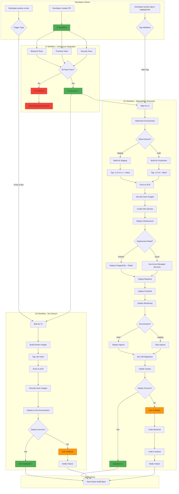
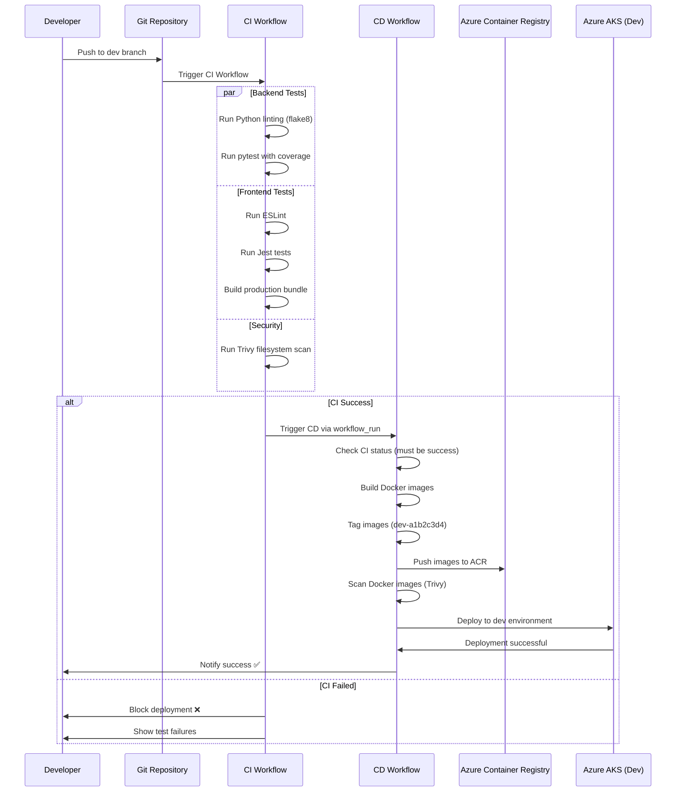
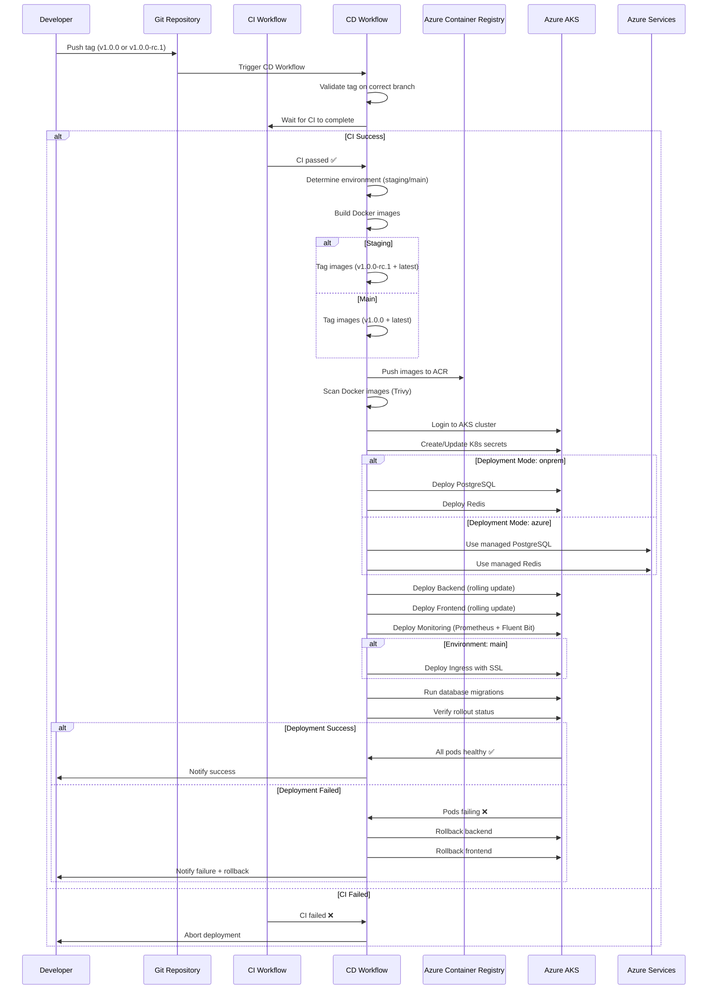
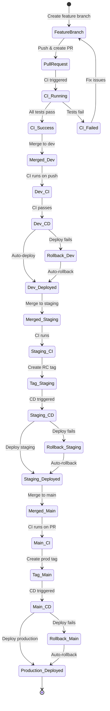

# Branching Strategy & CI/CD Workflow

This document outlines the branching strategy and CI/CD workflow for the AI SaaS Dashboard project.

## Branch Structure

```
main (production)
  ├── staging (pre-production)
  └── dev (development)
```

## CI/CD Flow Diagram



## Detailed CI/CD Flow by Branch

### Dev Branch Flow



### Staging/Main Branch Flow



## Complete Workflow States



### Branch Overview

| Branch | Purpose | Protection | Deployment Target |
|--------|---------|------------|-------------------|
| **main** | Production-ready code | Protected, requires PR + CI | Production (Azure AKS) |
| **staging** | Pre-production testing | Protected, requires PR + CI | Staging (Azure AKS) |
| **dev** | Active development | CI runs on push | Dev (Azure AKS) |

---

## CI/CD Pipeline

### 🧪 Continuous Integration (CI)

**Workflow**: `.github/workflows/ci.yml`

**Triggers**:
- Pull requests to: `main`, `staging`, `dev`
- Pushes to: `dev`, `staging`

**Jobs**:
1. **Backend Tests**
   - Linting with flake8
   - Unit tests with pytest
   - Coverage reporting
   - Services: PostgreSQL, Redis

2. **Frontend Tests**
   - ESLint checks
   - Jest unit tests
   - Production build validation
   - Coverage reporting

3. **Security Scan**
   - Trivy vulnerability scanning
   - SARIF upload to GitHub Security

**Requirements**: All CI jobs must pass before merging PRs

---

### 🚀 Continuous Deployment (CD)

**Workflow**: `.github/workflows/cd.yml`

**Triggers**:
- **Dev Environment**: Automatic on push to `dev` (after CI passes)
- **Staging Environment**: Manual tag push `v*` on `staging` branch
- **Main Environment**: Manual tag push `v*` on `main` branch
- **Manual Trigger**: Via workflow_dispatch for any environment

**Jobs**:

1. **Check CI Status**
   - Ensures CI passed before deployment
   - Validates branch and environment

2. **Build & Push Docker Images**
   - Backend image: `ai-saas-backend`
   - Frontend image: `ai-saas-frontend`
   - Tags:
     - Dev: `dev-{commit-hash}`
     - Staging/Main: Git tag (e.g., `v1.0.0`)
   - Push to Azure Container Registry
   - Vulnerability scanning with Trivy

3. **Deploy to Azure AKS**
   - Create Kubernetes namespaces
   - Deploy secrets and configmaps
   - Deploy backend (3 replicas, auto-scaling)
   - Deploy frontend (nginx)
   - Deploy monitoring stack (Prometheus, Fluent Bit)
   - Deploy ingress (main environment only)
   - Run database migrations (onprem mode only)

4. **Rollback** (on failure)
   - Automatic rollback to previous version

**Deployment Modes**:
- **Azure**: Uses managed Azure PostgreSQL, Redis, and Storage
- **On-Premise**: Deploys PostgreSQL and Redis in-cluster

---

## Workflow Examples

### 🔹 Development Workflow

```bash
# 1. Create feature branch from dev
git checkout dev
git pull origin dev
git checkout -b feature/my-feature

# 2. Make changes and commit
git add .
git commit -m "feat: add new feature"

# 3. Push and create PR to dev
git push origin feature/my-feature
# Create PR on GitHub targeting 'dev' branch

# 4. CI runs automatically on PR
# - Backend tests
# - Frontend tests
# - Security scan

# 5. After PR approval and CI passes, merge to dev
# CD automatically deploys to dev environment
```

### 🔹 Staging Release Workflow

```bash
# 1. Merge dev into staging
git checkout staging
git pull origin staging
git merge dev

# 2. Push to staging (triggers CI)
git push origin staging

# 3. After CI passes, create release tag
git tag -a v1.0.0-rc.1 -m "Release candidate 1.0.0"
git push origin v1.0.0-rc.1

# 4. CD deploys to staging environment
```

### 🔹 Production Release Workflow

```bash
# 1. After staging testing, merge staging into main
git checkout main
git pull origin main
git merge staging

# 2. Create PR to main (requires reviews)
# CI runs on PR

# 3. After PR approval and merge, create production tag
git checkout main
git pull origin main
git tag -a v1.0.0 -m "Production release 1.0.0"
git push origin v1.0.0

# 4. CD deploys to production (main) environment
```

### 🔹 Hotfix Workflow

```bash
# 1. Create hotfix branch from main
git checkout main
git checkout -b hotfix/critical-bug

# 2. Fix the issue and commit
git add .
git commit -m "fix: resolve critical bug"

# 3. Create PR to main
git push origin hotfix/critical-bug
# CI runs automatically

# 4. After approval, merge and tag
git checkout main
git merge hotfix/critical-bug
git tag -a v1.0.1 -m "Hotfix 1.0.1"
git push origin v1.0.1

# 5. Backport to staging and dev
git checkout staging
git merge hotfix/critical-bug
git push origin staging

git checkout dev
git merge hotfix/critical-bug
git push origin dev
```

---

## Tag Convention

Tags follow semantic versioning: `vMAJOR.MINOR.PATCH`

- **Production**: `v1.0.0`, `v1.0.1`, `v2.0.0`
- **Staging/RC**: `v1.0.0-rc.1`, `v1.0.0-rc.2`
- **Beta**: `v1.0.0-beta.1` (optional)

---

## Environment Configuration

### Dev Environment
- **Auto-deploy**: Yes (on every push)
- **Database**: In-cluster PostgreSQL or Azure managed
- **Redis**: In-cluster Redis or Azure managed
- **Monitoring**: Prometheus + Fluent Bit
- **Ingress**: Optional

### Staging Environment
- **Auto-deploy**: No (tag-based)
- **Database**: Azure managed PostgreSQL (recommended)
- **Redis**: Azure managed Redis (recommended)
- **Monitoring**: Full stack with alerts
- **Ingress**: Yes

### Main (Production) Environment
- **Auto-deploy**: No (tag-based)
- **Database**: Azure managed PostgreSQL
- **Redis**: Azure managed Redis
- **Monitoring**: Full stack with alerts + logging
- **Ingress**: Yes (with SSL/TLS)
- **Replicas**: 3-10 (auto-scaling)

---

## Required GitHub Secrets

### Azure Credentials
- `AZURE_CREDENTIALS` - Service principal credentials
- `AZURE_CONTAINER_REGISTRY` - ACR name
- `ACR_USERNAME` - ACR username
- `ACR_PASSWORD` - ACR password
- `AKS_CLUSTER_NAME` - AKS cluster name
- `AKS_RESOURCE_GROUP` - Azure resource group

### Application Secrets
- `SECRET_KEY` - Flask secret key
- `JWT_SECRET_KEY` - JWT signing key
- `POSTGRES_PASSWORD` - Database password
- `AI_API_KEY` - AI service API key
- `AI_API_URL` - AI service endpoint
- `REDIS_PASSWORD` - Redis password

### Azure Services (Azure mode)
- `AZURE_POSTGRES_HOST` - Managed PostgreSQL host
- `AZURE_POSTGRES_PASSWORD` - Managed PostgreSQL password
- `AZURE_REDIS_HOST` - Managed Redis host
- `AZURE_REDIS_KEY` - Managed Redis key
- `AZURE_STORAGE_CONNECTION_STRING` - Azure Storage connection

### Monitoring
- `AZURE_LOG_ANALYTICS_WORKSPACE_ID` - Log Analytics workspace ID
- `AZURE_LOG_ANALYTICS_WORKSPACE_KEY` - Log Analytics key
- `MONITORING_PASSWORD` - Basic auth password for monitoring UI

### Notifications (Optional)
- `SLACK_WEBHOOK` - Slack webhook URL for deployment notifications

---

## Best Practices

### ✅ Do's
- Always create feature branches from `dev`
- Write descriptive commit messages
- Keep branches up to date with parent branch
- Run tests locally before pushing
- Tag releases only after thorough testing
- Review deployment logs after CD runs

### ❌ Don'ts
- Don't commit directly to `main` or `staging`
- Don't skip CI checks
- Don't deploy to production without staging validation
- Don't use `--force` push on protected branches
- Don't commit secrets or credentials

---

## Monitoring & Rollback

### Monitoring Deployment
```bash
# Check deployment status
kubectl get pods -n app-backend
kubectl get pods -n app-frontend
kubectl get pods -n shared

# View logs
kubectl logs -f deployment/backend -n app-backend
kubectl logs -f deployment/frontend -n app-frontend

# Check rollout status
kubectl rollout status deployment/backend -n app-backend
```

### Manual Rollback
```bash
# Rollback backend
kubectl rollout undo deployment/backend -n app-backend

# Rollback frontend
kubectl rollout undo deployment/frontend -n app-frontend

# Rollback to specific revision
kubectl rollout undo deployment/backend -n app-backend --to-revision=2
```

---

## Troubleshooting

### CI Fails
1. Check workflow logs in GitHub Actions
2. Verify all tests pass locally
3. Check for linting errors
4. Ensure dependencies are up to date

### CD Fails
1. Verify Azure credentials are valid
2. Check Kubernetes cluster health
3. Ensure all required secrets are set
4. Review deployment logs
5. Check Docker images were pushed successfully

### Deployment Issues
1. Check pod status: `kubectl get pods -n <namespace>`
2. View pod logs: `kubectl logs <pod-name> -n <namespace>`
3. Check events: `kubectl get events -n <namespace>`
4. Verify secrets: `kubectl get secrets -n <namespace>`
5. Check ingress: `kubectl get ingress -A`

---

## Support

For questions or issues with the CI/CD pipeline:
1. Check GitHub Actions logs
2. Review this documentation
3. Contact the DevOps team
4. Create an issue in the repository

---

**Last Updated**: 2025-11-13
**Version**: 1.0.0
