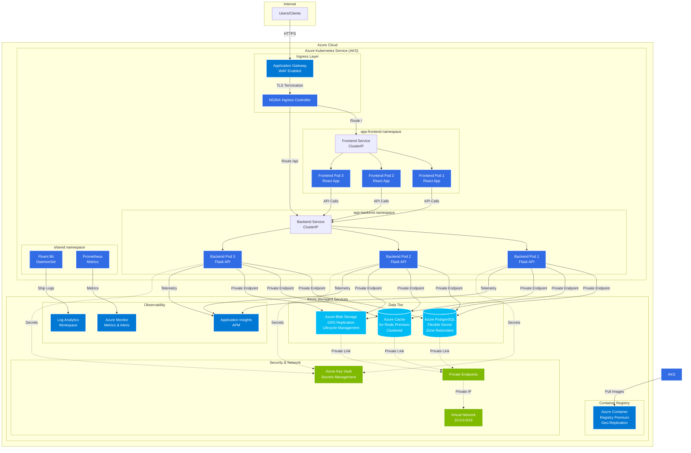
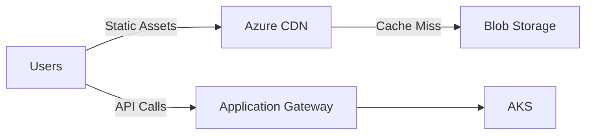
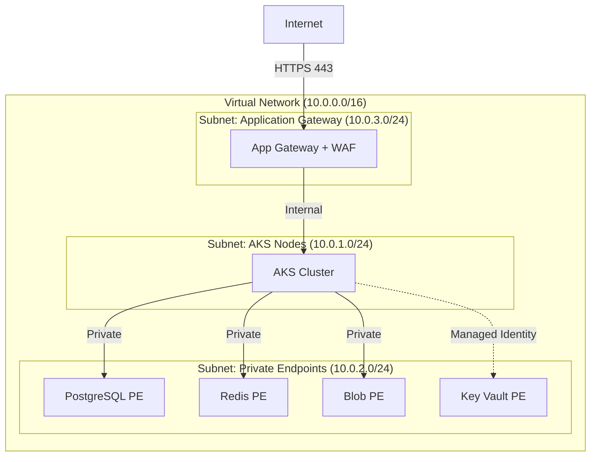
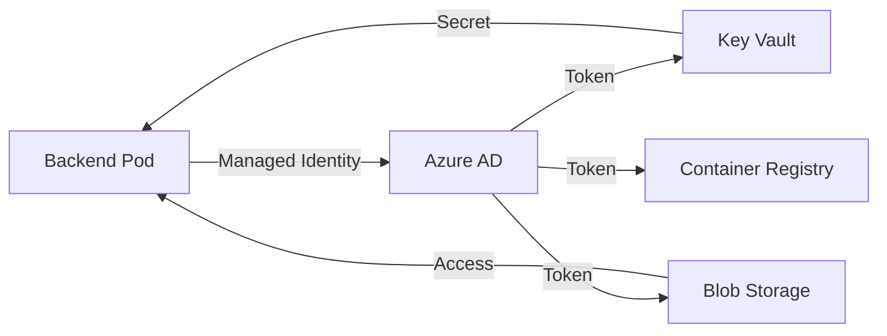
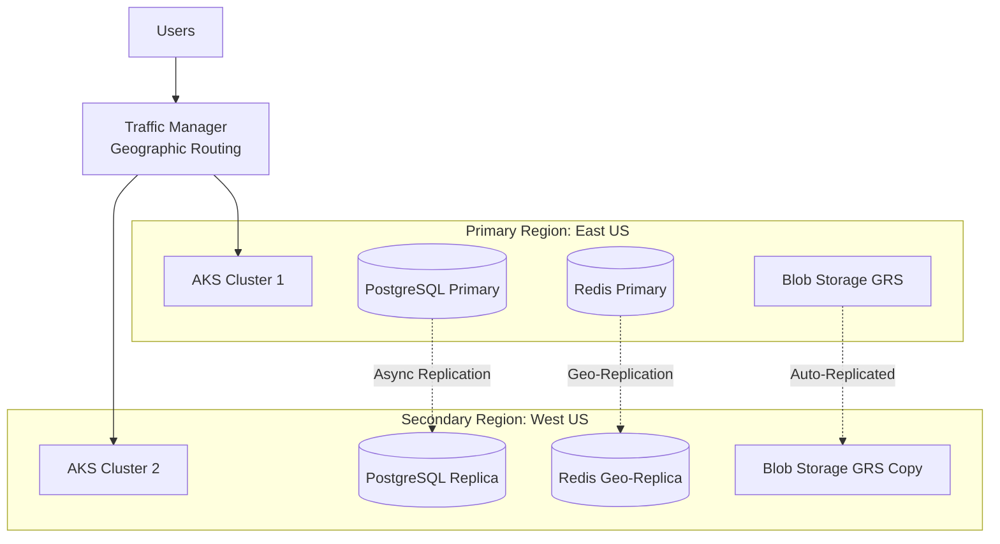
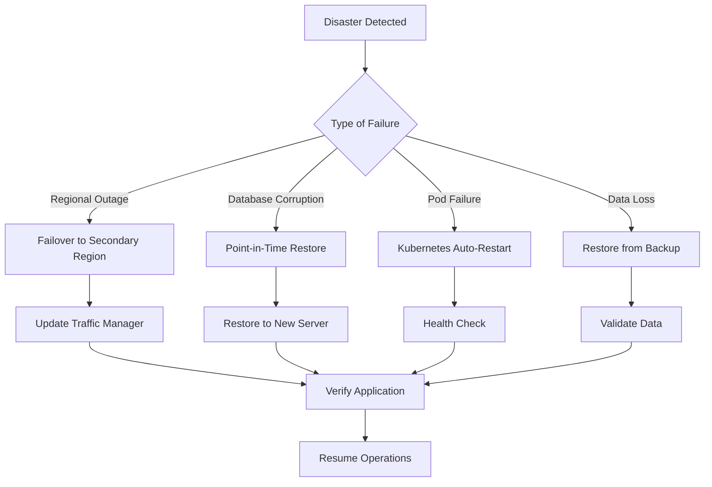

# Azure Managed Services Architecture

This document provides a comprehensive overview of the AI SaaS Dashboard architecture when deployed using Azure managed services.

## Table of Contents
- [Overview](#overview)
- [Architecture Diagram](#architecture-diagram)
- [Component Details](#component-details)
- [Scalability Strategy](#scalability-strategy)
- [Security Implementation](#security-implementation)
- [Cross-Platform Support](#cross-platform-support)
- [High Availability](#high-availability)
- [Disaster Recovery](#disaster-recovery)

## Overview

The Azure managed services deployment leverages Azure's Platform-as-a-Service (PaaS) offerings to provide a production-ready, enterprise-grade solution with minimal operational overhead. This architecture prioritizes:

- **Managed Infrastructure**: Database, cache, and storage managed by Microsoft
- **High Availability**: Multi-zone redundancy and automatic failover
- **Security**: Private endpoints, VNet integration, and managed identities
- **Scalability**: Independent scaling of all components
- **Observability**: Built-in monitoring and logging

## Architecture Diagram



## Component Details

### 1. Application Gateway (WAF)
**Purpose**: Entry point with Web Application Firewall protection

**Features**:
- WAF with OWASP rule sets
- SSL/TLS termination
- Path-based routing
- Auto-scaling capabilities
- DDoS protection

**Configuration**:
```yaml
SKU: WAF_v2
Capacity: Auto-scale (2-10 instances)
Public IP: Static
```

### 2. Azure Kubernetes Service (AKS)
**Purpose**: Container orchestration platform

**Specifications**:
- **Node Pools**:
  - System pool: 3 nodes (Standard_D4s_v3)
  - User pool: 3-10 nodes (auto-scale)
  - Spot pool: 0-5 nodes (cost optimization)
- **Kubernetes Version**: 1.28+
- **Network Plugin**: Azure CNI
- **Network Policy**: Azure or Calico
- **RBAC**: Enabled with Azure AD integration

**Namespaces**:
1. `app-frontend`: Frontend React application
2. `app-backend`: Backend Flask API
3. `shared`: Monitoring and shared services

### 3. Frontend Application
**Technology**: React 18, Nginx

**Deployment**:
- **Replicas**: 3 (auto-scale 2-10)
- **Resources**:
  - Requests: 100m CPU, 128Mi memory
  - Limits: 500m CPU, 512Mi memory
- **Probes**:
  - Liveness: HTTP GET /
  - Readiness: HTTP GET /

**Features**:
- Server-side rendering ready
- Optimized production build
- Brotli/Gzip compression
- HTTP/2 support

### 4. Backend Application
**Technology**: Flask 3.0, Gunicorn, Python 3.11

**Deployment**:
- **Replicas**: 3 (auto-scale 2-15)
- **Resources**:
  - Requests: 500m CPU, 512Mi memory
  - Limits: 2000m CPU, 2Gi memory
- **Workers**: 4 Gunicorn workers per pod
- **Connection Pooling**: PgBouncer integrated

**Environment Variables**:
```env
STORAGE_TYPE=azure
AZURE_STORAGE_CONNECTION_STRING=<from-keyvault>
AZURE_STORAGE_CONTAINER=uploaded-files
DATABASE_HOST=<postgres-fqdn>
DATABASE_SSL_MODE=require
REDIS_HOST=<redis-fqdn>
REDIS_SSL=true
```

### 5. Azure PostgreSQL Flexible Server
**Purpose**: Primary relational database

**Configuration**:
- **SKU**: General Purpose (D4s_v3)
- **Storage**: 128GB (auto-grow enabled)
- **Backup**: 7-day retention, geo-redundant
- **High Availability**: Zone-redundant
- **Version**: PostgreSQL 15
- **SSL**: Required (TLS 1.2+)

**Connection Details**:
- **Private Endpoint**: Yes (no public access)
- **Connection Pooling**: PgBouncer on backend
- **Max Connections**: 200

**Performance**:
- **IOPS**: Provisioned (5000)
- **Read Replicas**: Optional (for read-heavy workloads)

### 6. Azure Cache for Redis (Premium)
**Purpose**: Session management and caching

**Configuration**:
- **Tier**: Premium P1 (6GB)
- **Clustering**: Enabled (2 shards)
- **Replication**: 1 replica per shard
- **Persistence**: RDB snapshots (every 15 min)
- **SSL**: Required (port 6380)

**Use Cases**:
- Session storage
- Rate limiting
- API response caching
- Pub/sub for real-time features

### 7. Azure Blob Storage
**Purpose**: File uploads and document storage

**Configuration**:
- **Performance**: Standard (Hot tier)
- **Replication**: GRS (Geo-redundant)
- **Access Tier Lifecycle**:
  - Hot: 0-30 days
  - Cool: 31-90 days
  - Archive: 91-365 days
  - Delete: After 365 days
- **Features**:
  - Versioning enabled
  - Soft delete (7 days)
  - Change feed enabled
  - Private endpoint access

**Container Structure**:
```
uploaded-files/
├── user_123/
│   ├── file1.pdf
│   └── file2.docx
└── user_456/
    └── file3.jpg
```

### 8. Azure Container Registry (Premium)
**Purpose**: Private Docker image registry

**Features**:
- Geo-replication (multi-region)
- Vulnerability scanning (Defender for Cloud)
- Content trust and signing
- Webhook notifications
- Private endpoint access

### 9. Monitoring Stack

#### Azure Log Analytics
**Purpose**: Centralized log aggregation

**Data Sources**:
- Fluent Bit (pod logs)
- AKS diagnostics
- Azure resource logs
- Application logs

**Sample Query**:
```kusto
ContainerLog
| where Namespace in ("app-backend", "app-frontend", "shared")
| where TimeGenerated > ago(1h)
| project TimeGenerated, Computer, ContainerName, LogEntry
| order by TimeGenerated desc
```

#### Application Insights
**Purpose**: Application Performance Monitoring (APM)

**Tracked Metrics**:
- Request/response times
- Dependency calls (DB, Redis, Blob)
- Exception tracking
- Custom events
- User behavior

#### Prometheus
**Purpose**: Kubernetes and application metrics

**Scraped Targets**:
- Kubernetes API server
- Node exporter
- Backend /metrics endpoint
- Redis exporter

### 10. Security Components

#### Azure Key Vault
**Purpose**: Secrets and certificate management

**Stored Secrets**:
- Database passwords
- Redis access keys
- Storage connection strings
- API keys
- JWT signing keys
- SSL/TLS certificates

**Access Method**:
- Managed Identity (workload identity)
- CSI driver for pod secrets

#### Private Endpoints
**Purpose**: Secure private connectivity

**Connected Services**:
- Azure PostgreSQL
- Azure Redis Cache
- Azure Blob Storage
- Azure Container Registry
- Azure Key Vault

**Benefits**:
- No public internet exposure
- Traffic stays on Azure backbone
- Private DNS integration

## Scalability Strategy

### 1. Horizontal Pod Autoscaling (HPA)

**Backend HPA**:
```yaml
apiVersion: autoscaling/v2
kind: HorizontalPodAutoscaler
metadata:
  name: backend-hpa
spec:
  scaleTargetRef:
    apiVersion: apps/v1
    kind: Deployment
    name: backend
  minReplicas: 3
  maxReplicas: 15
  metrics:
  - type: Resource
    resource:
      name: cpu
      target:
        type: Utilization
        averageUtilization: 70
  - type: Resource
    resource:
      name: memory
      target:
        type: Utilization
        averageUtilization: 80
  behavior:
    scaleUp:
      stabilizationWindowSeconds: 60
      policies:
      - type: Percent
        value: 50
        periodSeconds: 60
    scaleDown:
      stabilizationWindowSeconds: 300
      policies:
      - type: Pods
        value: 1
        periodSeconds: 120
```

**Frontend HPA**:
```yaml
minReplicas: 2
maxReplicas: 10
targetCPUUtilization: 70%
```

### 2. Cluster Autoscaling

**AKS Node Pool Auto-scaling**:
```hcl
resource "azurerm_kubernetes_cluster_node_pool" "user" {
  enable_auto_scaling = true
  min_count          = 3
  max_count          = 10
  vm_size            = "Standard_D4s_v3"
}
```

**Scaling Triggers**:
- Pod resource requests cannot be scheduled
- Node utilization > 80% for 5 minutes
- Pending pods waiting for resources

### 3. Database Scaling

**Vertical Scaling** (Automated):
- CPU threshold: Scale up at 80% for 5 min
- Memory threshold: Scale up at 85%
- Storage: Auto-grow enabled

**Read Replicas** (Manual):
```bash
az postgres flexible-server replica create \
  --resource-group $RG \
  --name myserver-replica \
  --source-server myserver
```

**Connection Pooling**:
- PgBouncer: 100 connections per backend pod
- Max connections: 200 on PostgreSQL
- Transaction pooling mode

### 4. Redis Scaling

**Horizontal Scaling**:
- Premium tier supports clustering
- Add shards via Azure Portal
- Automatic data redistribution

**Vertical Scaling**:
- Scale up to P5 (120GB) without downtime
- Automatic failover during scaling

### 5. Storage Scaling

**Blob Storage**:
- No manual scaling required
- Automatic partition management
- Handles millions of objects
- Throughput: Up to 20,000 requests/sec per account

**Blob Lifecycle Management**:
```json
{
  "rules": [
    {
      "name": "move-to-cool",
      "type": "Lifecycle",
      "definition": {
        "actions": {
          "baseBlob": {
            "tierToCool": {
              "daysAfterModificationGreaterThan": 30
            },
            "tierToArchive": {
              "daysAfterModificationGreaterThan": 90
            },
            "delete": {
              "daysAfterModificationGreaterThan": 365
            }
          }
        }
      }
    }
  ]
}
```

### 6. Load Balancing

**Application Gateway**:
- Auto-scaling: 2-10 instances
- Round-robin distribution
- Session affinity (cookie-based)
- Health probes with auto-removal

**AKS Internal Load Balancing**:
```yaml
apiVersion: v1
kind: Service
metadata:
  name: backend-service
spec:
  type: ClusterIP
  sessionAffinity: ClientIP  # For sticky sessions
  selector:
    app: backend
  ports:
  - port: 5000
    targetPort: 5000
```

### 7. Performance Optimization

**CDN Integration** (Optional):


**Caching Strategy**:
1. **Browser Cache**: Static assets (1 week)
2. **CDN Cache**: Images, JS, CSS (1 month)
3. **Redis Cache**: API responses (5-60 min)
4. **Application Cache**: Configuration data (in-memory)

## Security Implementation

### 1. Network Security

#### Network Segmentation


#### Network Security Groups (NSG)
```hcl
resource "azurerm_network_security_rule" "allow_https" {
  name                        = "AllowHTTPS"
  priority                    = 100
  direction                   = "Inbound"
  access                      = "Allow"
  protocol                    = "Tcp"
  source_port_range          = "*"
  destination_port_range     = "443"
  source_address_prefix      = "Internet"
  destination_address_prefix = "*"
}

resource "azurerm_network_security_rule" "deny_all_inbound" {
  name                       = "DenyAllInbound"
  priority                   = 4096
  direction                  = "Inbound"
  access                     = "Deny"
  protocol                   = "*"
  source_port_range         = "*"
  destination_port_range    = "*"
  source_address_prefix     = "*"
  destination_address_prefix = "*"
}
```

#### Network Policies (Kubernetes)
```yaml
apiVersion: networking.k8s.io/v1
kind: NetworkPolicy
metadata:
  name: backend-network-policy
  namespace: app-backend
spec:
  podSelector:
    matchLabels:
      app: backend
  policyTypes:
  - Ingress
  - Egress
  ingress:
  - from:
    - namespaceSelector:
        matchLabels:
          name: app-frontend
    - namespaceSelector:
        matchLabels:
          name: ingress-nginx
    ports:
    - protocol: TCP
      port: 5000
  egress:
  - to:
    - podSelector:
        matchLabels:
          app: postgres  # Only for on-prem mode
    ports:
    - protocol: TCP
      port: 5432
  - to:  # Allow DNS
    - namespaceSelector: {}
    ports:
    - protocol: UDP
      port: 53
```

### 2. Identity and Access Management

#### Managed Identities


**Workload Identity Configuration**:
```yaml
apiVersion: v1
kind: ServiceAccount
metadata:
  name: backend-sa
  namespace: app-backend
  annotations:
    azure.workload.identity/client-id: <managed-identity-client-id>
---
apiVersion: apps/v1
kind: Deployment
metadata:
  name: backend
spec:
  template:
    metadata:
      labels:
        azure.workload.identity/use: "true"
    spec:
      serviceAccountName: backend-sa
      containers:
      - name: backend
        image: acr.azurecr.io/backend:latest
```

#### RBAC (Role-Based Access Control)

**Azure RBAC** for AKS:
```bash
# Developers - Read-only access
az role assignment create \
  --role "Azure Kubernetes Service Cluster User Role" \
  --assignee <user-or-group> \
  --scope /subscriptions/<sub-id>/resourceGroups/<rg>/providers/Microsoft.ContainerService/managedClusters/<aks>

# Operators - Admin access
az role assignment create \
  --role "Azure Kubernetes Service Cluster Admin Role" \
  --assignee <user-or-group> \
  --scope <aks-scope>
```

**Kubernetes RBAC**:
```yaml
apiVersion: rbac.authorization.k8s.io/v1
kind: Role
metadata:
  namespace: app-backend
  name: backend-deployer
rules:
- apiGroups: ["apps", ""]
  resources: ["deployments", "pods", "services", "configmaps"]
  verbs: ["get", "list", "watch", "create", "update", "patch"]
---
apiVersion: rbac.authorization.k8s.io/v1
kind: RoleBinding
metadata:
  name: backend-deployer-binding
  namespace: app-backend
subjects:
- kind: Group
  name: "backend-team"
  apiGroup: rbac.authorization.k8s.io
roleRef:
  kind: Role
  name: backend-deployer
  apiGroup: rbac.authorization.k8s.io
```

### 3. Data Encryption

#### Encryption at Rest
- **AKS**: Azure Disk Encryption (ADE) with customer-managed keys
- **PostgreSQL**: Transparent Data Encryption (TDE)
- **Redis**: Encrypted with Azure platform keys
- **Blob Storage**: AES-256 encryption with CMK option
- **Key Vault**: FIPS 140-2 Level 2 validated HSMs

#### Encryption in Transit
- **TLS 1.2+**: Required for all connections
- **Application Gateway**: TLS termination with strong cipher suites
- **PostgreSQL**: `sslmode=require` enforced
- **Redis**: SSL enabled (port 6380)
- **Blob Storage**: HTTPS only

**TLS Configuration**:
```yaml
apiVersion: networking.k8s.io/v1
kind: Ingress
metadata:
  name: app-ingress
  annotations:
    nginx.ingress.kubernetes.io/ssl-protocols: "TLSv1.2 TLSv1.3"
    nginx.ingress.kubernetes.io/ssl-ciphers: "ECDHE-ECDSA-AES128-GCM-SHA256:ECDHE-RSA-AES128-GCM-SHA256"
spec:
  tls:
  - hosts:
    - app.example.com
    secretName: tls-certificate
```

### 4. Secrets Management

#### Azure Key Vault Integration
```yaml
apiVersion: secrets-store.csi.x-k8s.io/v1
kind: SecretProviderClass
metadata:
  name: azure-keyvault
spec:
  provider: azure
  parameters:
    usePodIdentity: "false"
    useVMManagedIdentity: "true"
    userAssignedIdentityID: <identity-client-id>
    keyvaultName: <keyvault-name>
    objects: |
      array:
        - |
          objectName: database-password
          objectType: secret
          objectVersion: ""
        - |
          objectName: redis-password
          objectType: secret
          objectVersion: ""
    tenantId: <tenant-id>
```

**Pod Volume Mount**:
```yaml
volumes:
- name: secrets-store
  csi:
    driver: secrets-store.csi.k8s.io
    readOnly: true
    volumeAttributes:
      secretProviderClass: azure-keyvault

containers:
- name: backend
  volumeMounts:
  - name: secrets-store
    mountPath: "/mnt/secrets"
    readOnly: true
```

### 5. Security Scanning and Compliance

#### Container Image Scanning
```yaml
# Azure Defender for Containers
- Vulnerability assessment (CVE scanning)
- Runtime threat detection
- Kubernetes security posture management
```

**GitHub Actions Security**:
```yaml
- name: Run Trivy vulnerability scanner
  uses: aquasecurity/trivy-action@master
  with:
    image-ref: ${{ env.ACR }}.azurecr.io/backend:${{ env.TAG }}
    format: 'sarif'
    output: 'trivy-results.sarif'
    severity: 'CRITICAL,HIGH'
```

#### Pod Security Standards
```yaml
apiVersion: v1
kind: Namespace
metadata:
  name: app-backend
  labels:
    pod-security.kubernetes.io/enforce: restricted
    pod-security.kubernetes.io/audit: restricted
    pod-security.kubernetes.io/warn: restricted
```

**Security Context**:
```yaml
securityContext:
  runAsNonRoot: true
  runAsUser: 1000
  fsGroup: 1000
  allowPrivilegeEscalation: false
  capabilities:
    drop:
    - ALL
  readOnlyRootFilesystem: true
```

### 6. Audit Logging

**Azure Activity Logs**:
- All Azure resource operations
- 90-day retention
- Exported to Log Analytics

**Kubernetes Audit Logs**:
```json
{
  "kind": "Policy",
  "apiVersion": "audit.k8s.io/v1",
  "rules": [
    {
      "level": "RequestResponse",
      "resources": [
        {
          "group": "",
          "resources": ["secrets", "configmaps"]
        }
      ]
    }
  ]
}
```

### 7. WAF Rules

**Application Gateway WAF**:
- OWASP Core Rule Set 3.2
- SQL injection protection
- Cross-site scripting (XSS) prevention
- Local file inclusion (LFI) prevention
- Protocol enforcement

**Custom Rules**:
```json
{
  "customRules": [
    {
      "name": "RateLimitRule",
      "priority": 1,
      "ruleType": "RateLimitRule",
      "rateLimitThreshold": 100,
      "rateLimitDuration": "PT1M",
      "action": "Block"
    },
    {
      "name": "GeoFilterRule",
      "priority": 2,
      "ruleType": "MatchRule",
      "matchConditions": [
        {
          "matchVariables": [{"variableName": "RemoteAddr"}],
          "operator": "GeoMatch",
          "negationConditon": true,
          "matchValues": ["US", "CA", "GB", "DE", "FR"]
        }
      ],
      "action": "Block"
    }
  ]
}
```

## Cross-Platform Support

### 1. Multi-Region Deployment



**Traffic Manager Configuration**:
```hcl
resource "azurerm_traffic_manager_profile" "main" {
  name                   = "ai-saas-tm"
  resource_group_name    = azurerm_resource_group.main.name
  traffic_routing_method = "Geographic"

  dns_config {
    relative_name = "ai-saas-app"
    ttl          = 60
  }

  monitor_config {
    protocol                     = "HTTPS"
    port                        = 443
    path                        = "/health"
    interval_in_seconds         = 30
    timeout_in_seconds          = 10
    tolerated_number_of_failures = 3
  }
}
```

### 2. Container Platform Portability

**Docker Compose → Kubernetes Migration**:
```yaml
# docker-compose.yml (Development)
version: '3.8'
services:
  backend:
    build: ./backend
    environment:
      - STORAGE_TYPE=local
    volumes:
      - uploaded_files:/app/uploaded_files

# kubernetes manifest (Production)
apiVersion: apps/v1
kind: Deployment
metadata:
  name: backend
spec:
  template:
    spec:
      containers:
      - name: backend
        image: acr.azurecr.io/backend:v1.0.0
        env:
        - name: STORAGE_TYPE
          value: "azure"
```

### 3. Cloud Provider Abstraction

**Storage Abstraction Layer** (Already Implemented):
```python
# backend/app/services/storage_service.py
class StorageBackend(ABC):
    @abstractmethod
    def save(self, file_data: bytes, filename: str):
        pass

    @abstractmethod
    def delete(self, storage_path: str):
        pass

class AzureBlobStorageBackend(StorageBackend):
    # Azure implementation

class AWSStorageBackend(StorageBackend):
    # AWS S3 implementation (future)

class GCPStorageBackend(StorageBackend):
    # Google Cloud Storage implementation (future)
```

### 4. Infrastructure as Code (IaC)

**Terraform Modules** for portability:
```
infra/terraform/
├── modules/
│   ├── aks/
│   ├── database/
│   ├── cache/
│   └── storage/
├── azure/
│   └── main.tf
├── aws/  # Future
│   └── main.tf
└── gcp/  # Future
    └── main.tf
```

### 5. CI/CD Platform Independence

**GitHub Actions + Azure DevOps**:
```yaml
# .github/workflows/cd.yml
- name: Deploy to AKS
  run: |
    kubectl apply -f infra/k8s/base/

# azure-pipelines.yml (Alternative)
- task: KubernetesManifest@0
  inputs:
    action: 'deploy'
    manifests: 'infra/k8s/base/*.yaml'
```

### 6. API Compatibility

**RESTful API Design**:
- Platform-agnostic endpoints
- Standard HTTP methods
- JSON payload format
- OAuth 2.0 / JWT authentication
- OpenAPI 3.0 specification

**API Versioning**:
```
/api/v1/files       # Version 1
/api/v2/files       # Version 2 (future)
```

### 7. Client SDKs

**Multi-platform client support**:
```
clients/
├── javascript/     # Web, Node.js
├── python/        # Python applications
├── java/          # Android, Java apps
├── swift/         # iOS, macOS
└── dotnet/        # .NET applications
```

## High Availability

### 1. Availability Zones

**AKS Node Distribution**:
```hcl
resource "azurerm_kubernetes_cluster_node_pool" "user" {
  zones = ["1", "2", "3"]  # Spread across 3 AZs

  # Anti-affinity to ensure pod distribution
}
```

**PostgreSQL Zone Redundancy**:
```hcl
resource "azurerm_postgresql_flexible_server" "main" {
  zone                   = "1"
  high_availability {
    mode                = "ZoneRedundant"
    standby_availability_zone = "2"
  }
}
```

### 2. Health Checks

**Kubernetes Probes**:
```yaml
livenessProbe:
  httpGet:
    path: /health/live
    port: 5000
  initialDelaySeconds: 30
  periodSeconds: 10
  timeoutSeconds: 5
  failureThreshold: 3

readinessProbe:
  httpGet:
    path: /health/ready
    port: 5000
  initialDelaySeconds: 10
  periodSeconds: 5
  timeoutSeconds: 3
  failureThreshold: 3
```

**Health Check Endpoints**:
```python
@app.route('/health/live')
def liveness():
    return jsonify({"status": "alive"}), 200

@app.route('/health/ready')
def readiness():
    # Check database connection
    # Check Redis connection
    # Check Blob Storage access
    if all_dependencies_healthy():
        return jsonify({"status": "ready"}), 200
    return jsonify({"status": "not ready"}), 503
```

### 3. Automatic Failover

**Database Failover**:
- Automatic failover to standby (< 120 seconds)
- Connection string remains the same
- Application retries with exponential backoff

**Redis Failover**:
- Automatic promotion of replica to primary
- Cluster mode ensures zero data loss
- Client reconnection automatic

### 4. Pod Disruption Budgets

```yaml
apiVersion: policy/v1
kind: PodDisruptionBudget
metadata:
  name: backend-pdb
spec:
  minAvailable: 2
  selector:
    matchLabels:
      app: backend
---
apiVersion: policy/v1
kind: PodDisruptionBudget
metadata:
  name: frontend-pdb
spec:
  maxUnavailable: 1
  selector:
    matchLabels:
      app: frontend
```

### 5. Graceful Shutdown

```python
import signal
import sys

def graceful_shutdown(signum, frame):
    print("Received shutdown signal, draining connections...")
    # Close database connections
    db.close()
    # Close Redis connections
    redis_client.close()
    # Stop accepting new requests
    sys.exit(0)

signal.signal(signal.SIGTERM, graceful_shutdown)
```

**Kubernetes Configuration**:
```yaml
lifecycle:
  preStop:
    exec:
      command: ["/bin/sh", "-c", "sleep 15"]
terminationGracePeriodSeconds: 30
```

## Disaster Recovery

### 1. Backup Strategy

**Database Backups**:
- Automated daily backups (7-day retention)
- Geo-redundant backup storage
- Point-in-time restore (PITR) up to 7 days
- Manual backup on-demand

**Blob Storage**:
- Geo-redundant replication (GRS)
- Soft delete (7-day retention)
- Blob versioning enabled
- Cross-region replication

### 2. Recovery Time Objective (RTO) / Recovery Point Objective (RPO)

| Component | RPO | RTO |
|-----------|-----|-----|
| AKS Cluster | 0 (stateless) | 15 min |
| PostgreSQL | 5 min | 2 hours |
| Redis Cache | 15 min | 30 min |
| Blob Storage | 0 (GRS) | 1 hour |
| Overall Application | 5 min | 2 hours |

### 3. Disaster Recovery Plan



### 4. Runbook Example

**PostgreSQL Restore**:
```bash
#!/bin/bash
# Disaster Recovery: PostgreSQL Restore

# Step 1: Create new PostgreSQL server from backup
az postgres flexible-server restore \
  --resource-group $RG \
  --name myserver-restored \
  --source-server myserver \
  --restore-point-in-time "2025-01-12T10:00:00Z"

# Step 2: Update connection string in Key Vault
az keyvault secret set \
  --vault-name $KV_NAME \
  --name database-host \
  --value "myserver-restored.postgres.database.azure.com"

# Step 3: Restart backend pods to pick up new connection
kubectl rollout restart deployment/backend -n app-backend

# Step 4: Verify connectivity
kubectl logs -n app-backend deployment/backend --tail=50 | grep "Database connected"
```

---

## Cost Optimization

### 1. Reserved Instances
- AKS nodes: 1-year or 3-year commitment (up to 72% savings)
- PostgreSQL: Reserved capacity pricing
- Redis Premium: Reserved instances

### 2. Auto-shutdown
- Dev/staging clusters: Auto-shutdown during off-hours
- Spot instances for non-critical workloads

### 3. Storage Optimization
- Lifecycle policies to move to cool/archive tiers
- Delete old log data
- Compress backups

---

## Monitoring and Alerting

### Key Metrics

**Application Metrics**:
- Request rate and latency (p50, p95, p99)
- Error rate (4xx, 5xx)
- Active users
- File upload success rate

**Infrastructure Metrics**:
- CPU and memory utilization
- Network throughput
- Disk IOPS
- Pod restart count

**Database Metrics**:
- Connection count
- Query latency
- Deadlocks
- Replication lag

### Alert Rules

```yaml
# High CPU Alert
- alert: HighCPUUsage
  expr: avg(cpu_usage) > 80
  for: 5m
  labels:
    severity: warning
  annotations:
    summary: "High CPU usage detected"

# Database Connection Alert
- alert: PostgreSQLConnectionsHigh
  expr: pg_connections > 180
  for: 5m
  labels:
    severity: critical
```

---

## Conclusion

The Azure managed services architecture provides:

✅ **Enterprise-grade reliability** with 99.95% SLA
✅ **Automatic scaling** at all layers
✅ **Comprehensive security** with defense-in-depth
✅ **Global reach** with multi-region support
✅ **Minimal operational overhead** with managed services
✅ **Cost-effective** with optimization strategies

**Best For**: Production workloads requiring high availability, strong security, and minimal operations.

---

**Last Updated**: 2025-01-12
**Version**: 1.0.0
