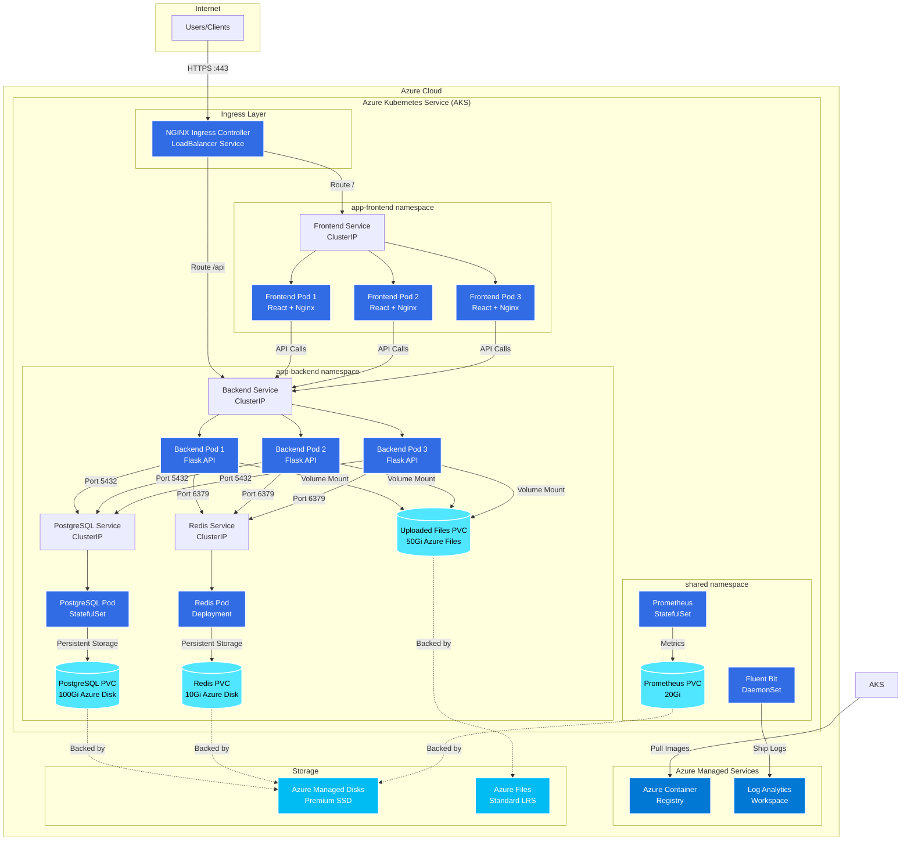

# On-Premise (In-Cluster) Architecture

This document provides a comprehensive overview of the AI SaaS Dashboard architecture when deployed using on-premise mode with all services running within the AKS cluster.

## Table of Contents
- [Overview](#overview)
- [Architecture Diagram](#architecture-diagram)
- [Component Details](#component-details)
- [Scalability Strategy](#scalability-strategy)
- [Security Implementation](#security-implementation)
- [Cross-Platform Support](#cross-platform-support)
- [High Availability](#high-availability)
- [Backup and Recovery](#backup-and-recovery)

## Overview

The on-premise deployment mode runs all infrastructure components (PostgreSQL, Redis, file storage) as containers within the AKS cluster. This architecture prioritizes:

- **Cost Efficiency**: ~$490/month vs $1,140/month for Azure managed services
- **Simplicity**: Fewer Azure resources to manage
- **Control**: Full control over database and cache configuration
- **Portability**: Can run on any Kubernetes cluster (AKS, GKE, EKS, on-prem)
- **Development-Friendly**: Ideal for dev, test, and staging environments

## Architecture Diagram



## Component Details

### 1. Ingress Controller
**Technology**: NGINX Ingress Controller

**Deployment**:
```yaml
apiVersion: v1
kind: Service
metadata:
  name: ingress-nginx-controller
spec:
  type: LoadBalancer
  ports:
  - name: http
    port: 80
    targetPort: http
  - name: https
    port: 443
    targetPort: https
```

**Features**:
- SSL/TLS termination
- Path-based routing
- Rate limiting
- Basic authentication
- CORS support

**Configuration**:
```yaml
apiVersion: networking.k8s.io/v1
kind: Ingress
metadata:
  name: app-ingress
  annotations:
    nginx.ingress.kubernetes.io/rate-limit: "100"
    nginx.ingress.kubernetes.io/ssl-redirect: "true"
spec:
  ingressClassName: nginx
  tls:
  - hosts:
    - app.example.com
    secretName: tls-secret
  rules:
  - host: app.example.com
    http:
      paths:
      - path: /api
        pathType: Prefix
        backend:
          service:
            name: backend-service
            port:
              number: 5000
      - path: /
        pathType: Prefix
        backend:
          service:
            name: frontend-service
            port:
              number: 80
```

### 2. Frontend Application
**Technology**: React 18, Nginx

**Deployment**:
```yaml
apiVersion: apps/v1
kind: Deployment
metadata:
  name: frontend
  namespace: app-frontend
spec:
  replicas: 3
  template:
    spec:
      containers:
      - name: frontend
        image: acr.azurecr.io/frontend:latest
        resources:
          requests:
            cpu: 100m
            memory: 128Mi
          limits:
            cpu: 500m
            memory: 512Mi
        ports:
        - containerPort: 80
```

**Resource Usage**:
- **CPU**: 50-100m per pod (low)
- **Memory**: 100-200Mi per pod
- **Total**: 3 pods = ~300m CPU, 600Mi memory

### 3. Backend Application
**Technology**: Flask 3.0, Gunicorn

**Deployment**:
```yaml
apiVersion: apps/v1
kind: Deployment
metadata:
  name: backend
  namespace: app-backend
spec:
  replicas: 3
  template:
    spec:
      containers:
      - name: backend
        image: acr.azurecr.io/backend:latest
        env:
        - name: STORAGE_TYPE
          value: "local"
        - name: UPLOAD_FOLDER
          value: "/app/uploaded_files"
        - name: DATABASE_HOST
          value: "postgres-service.app-backend.svc.cluster.local"
        - name: DATABASE_PORT
          value: "5432"
        - name: REDIS_HOST
          value: "redis-service.app-backend.svc.cluster.local"
        - name: REDIS_PORT
          value: "6379"
        volumeMounts:
        - name: uploaded-files
          mountPath: /app/uploaded_files
        resources:
          requests:
            cpu: 500m
            memory: 512Mi
          limits:
            cpu: 2000m
            memory: 2Gi
      volumes:
      - name: uploaded-files
        persistentVolumeClaim:
          claimName: uploaded-files-pvc
```

**Resource Usage**:
- **CPU**: 500m-2000m per pod
- **Memory**: 512Mi-2Gi per pod
- **Total**: 3 pods = 1.5-6 CPU, 1.5-6Gi memory

### 4. PostgreSQL Database
**Technology**: PostgreSQL 15 (Official Docker Image)

**StatefulSet Deployment**:
```yaml
apiVersion: apps/v1
kind: StatefulSet
metadata:
  name: postgres
  namespace: app-backend
spec:
  serviceName: postgres-service
  replicas: 1
  template:
    spec:
      containers:
      - name: postgres
        image: postgres:15-alpine
        env:
        - name: POSTGRES_DB
          value: "ai_saas_db"
        - name: POSTGRES_USER
          value: "postgres"
        - name: POSTGRES_PASSWORD
          valueFrom:
            secretKeyRef:
              name: backend-secrets
              key: POSTGRES_PASSWORD
        - name: PGDATA
          value: /var/lib/postgresql/data/pgdata
        ports:
        - containerPort: 5432
          name: postgres
        volumeMounts:
        - name: postgres-data
          mountPath: /var/lib/postgresql/data
        resources:
          requests:
            cpu: 1000m
            memory: 2Gi
          limits:
            cpu: 2000m
            memory: 4Gi
        livenessProbe:
          exec:
            command:
            - pg_isready
            - -U
            - postgres
          initialDelaySeconds: 30
          periodSeconds: 10
        readinessProbe:
          exec:
            command:
            - pg_isready
            - -U
            - postgres
          initialDelaySeconds: 10
          periodSeconds: 5
  volumeClaimTemplates:
  - metadata:
      name: postgres-data
    spec:
      accessModes: ["ReadWriteOnce"]
      storageClassName: managed-premium
      resources:
        requests:
          storage: 100Gi
```

**Service**:
```yaml
apiVersion: v1
kind: Service
metadata:
  name: postgres-service
  namespace: app-backend
spec:
  type: ClusterIP
  clusterIP: None  # Headless service for StatefulSet
  ports:
  - port: 5432
    targetPort: 5432
    name: postgres
  selector:
    app: postgres
```

**Resource Usage**:
- **CPU**: 1-2 cores
- **Memory**: 2-4Gi
- **Storage**: 100Gi Premium SSD (500 IOPS)

**PostgreSQL Configuration** (via ConfigMap):
```yaml
apiVersion: v1
kind: ConfigMap
metadata:
  name: postgres-config
data:
  postgresql.conf: |
    max_connections = 100
    shared_buffers = 512MB
    effective_cache_size = 2GB
    maintenance_work_mem = 256MB
    checkpoint_completion_target = 0.9
    wal_buffers = 16MB
    default_statistics_target = 100
    random_page_cost = 1.1
    effective_io_concurrency = 200
    work_mem = 5242kB
    min_wal_size = 1GB
    max_wal_size = 4GB
    max_worker_processes = 4
    max_parallel_workers_per_gather = 2
    max_parallel_workers = 4
```

### 5. Redis Cache
**Technology**: Redis 7.0 (Official Docker Image)

**Deployment**:
```yaml
apiVersion: apps/v1
kind: Deployment
metadata:
  name: redis
  namespace: app-backend
spec:
  replicas: 1
  template:
    spec:
      containers:
      - name: redis
        image: redis:7.0-alpine
        command:
        - redis-server
        - --appendonly
        - "yes"
        - --appendfsync
        - everysec
        - --maxmemory
        - "2gb"
        - --maxmemory-policy
        - allkeys-lru
        ports:
        - containerPort: 6379
          name: redis
        volumeMounts:
        - name: redis-data
          mountPath: /data
        resources:
          requests:
            cpu: 500m
            memory: 2Gi
          limits:
            cpu: 1000m
            memory: 3Gi
        livenessProbe:
          exec:
            command:
            - redis-cli
            - ping
          initialDelaySeconds: 30
          periodSeconds: 10
        readinessProbe:
          exec:
            command:
            - redis-cli
            - ping
          initialDelaySeconds: 10
          periodSeconds: 5
      volumes:
      - name: redis-data
        persistentVolumeClaim:
          claimName: redis-pvc
```

**PersistentVolumeClaim**:
```yaml
apiVersion: v1
kind: PersistentVolumeClaim
metadata:
  name: redis-pvc
  namespace: app-backend
spec:
  accessModes:
  - ReadWriteOnce
  storageClassName: managed-premium
  resources:
    requests:
      storage: 10Gi
```

**Service**:
```yaml
apiVersion: v1
kind: Service
metadata:
  name: redis-service
  namespace: app-backend
spec:
  type: ClusterIP
  ports:
  - port: 6379
    targetPort: 6379
  selector:
    app: redis
```

**Resource Usage**:
- **CPU**: 500m-1 core
- **Memory**: 2-3Gi
- **Storage**: 10Gi Premium SSD (for AOF persistence)

### 6. File Storage (PVC)
**Technology**: Azure Files (SMB)

**PersistentVolumeClaim**:
```yaml
apiVersion: v1
kind: PersistentVolumeClaim
metadata:
  name: uploaded-files-pvc
  namespace: app-backend
spec:
  accessModes:
  - ReadWriteMany  # Multiple pods can mount
  storageClassName: azurefile
  resources:
    requests:
      storage: 50Gi
```

**StorageClass**:
```yaml
apiVersion: storage.k8s.io/v1
kind: StorageClass
metadata:
  name: azurefile
provisioner: file.csi.azure.com
parameters:
  skuName: Standard_LRS
reclaimPolicy: Retain
volumeBindingMode: Immediate
mountOptions:
- dir_mode=0777
- file_mode=0777
- uid=1000
- gid=1000
- mfsymlinks
- cache=strict
```

**Features**:
- **ReadWriteMany**: All backend pods can access simultaneously
- **Standard LRS**: Locally redundant storage (cost-effective)
- **Capacity**: 50Gi (can grow as needed)
- **Performance**: Up to 60 MiB/s throughput

### 7. Monitoring Stack

#### Fluent Bit (Log Aggregation)
```yaml
apiVersion: apps/v1
kind: DaemonSet
metadata:
  name: fluent-bit
  namespace: shared
spec:
  template:
    spec:
      serviceAccountName: fluent-bit
      containers:
      - name: fluent-bit
        image: fluent/fluent-bit:2.0
        volumeMounts:
        - name: varlog
          mountPath: /var/log
          readOnly: true
        - name: varlibdockercontainers
          mountPath: /var/lib/docker/containers
          readOnly: true
        - name: config
          mountPath: /fluent-bit/etc/
      volumes:
      - name: varlog
        hostPath:
          path: /var/log
      - name: varlibdockercontainers
        hostPath:
          path: /var/lib/docker/containers
      - name: config
        configMap:
          name: fluent-bit-config
```

#### Prometheus (Metrics Collection)
```yaml
apiVersion: apps/v1
kind: StatefulSet
metadata:
  name: prometheus
  namespace: shared
spec:
  serviceName: prometheus
  replicas: 1
  template:
    spec:
      containers:
      - name: prometheus
        image: prom/prometheus:v2.45.0
        args:
        - --config.file=/etc/prometheus/prometheus.yml
        - --storage.tsdb.path=/prometheus
        - --storage.tsdb.retention.time=15d
        ports:
        - containerPort: 9090
        volumeMounts:
        - name: config
          mountPath: /etc/prometheus
        - name: data
          mountPath: /prometheus
        resources:
          requests:
            cpu: 500m
            memory: 1Gi
          limits:
            cpu: 1000m
            memory: 2Gi
  volumeClaimTemplates:
  - metadata:
      name: data
    spec:
      accessModes: ["ReadWriteOnce"]
      storageClassName: managed-premium
      resources:
        requests:
          storage: 20Gi
```

## Scalability Strategy

### 1. Horizontal Pod Autoscaling (HPA)

#### Backend HPA
```yaml
apiVersion: autoscaling/v2
kind: HorizontalPodAutoscaler
metadata:
  name: backend-hpa
  namespace: app-backend
spec:
  scaleTargetRef:
    apiVersion: apps/v1
    kind: Deployment
    name: backend
  minReplicas: 2
  maxReplicas: 10
  metrics:
  - type: Resource
    resource:
      name: cpu
      target:
        type: Utilization
        averageUtilization: 70
  - type: Resource
    resource:
      name: memory
      target:
        type: Utilization
        averageUtilization: 80
  behavior:
    scaleUp:
      stabilizationWindowSeconds: 60
      policies:
      - type: Percent
        value: 100  # Double the pods
        periodSeconds: 60
      - type: Pods
        value: 2
        periodSeconds: 60
      selectPolicy: Max
    scaleDown:
      stabilizationWindowSeconds: 300
      policies:
      - type: Pods
        value: 1
        periodSeconds: 120
      selectPolicy: Min
```

**Scaling Behavior**:
- Starts with 2 replicas
- Scales up when CPU > 70% or Memory > 80%
- Can scale up to 10 replicas
- Aggressive scale-up: doubles pods or adds 2 (whichever is greater)
- Conservative scale-down: removes 1 pod every 2 minutes
- 5-minute stabilization before scaling down

#### Frontend HPA
```yaml
apiVersion: autoscaling/v2
kind: HorizontalPodAutoscaler
metadata:
  name: frontend-hpa
  namespace: app-frontend
spec:
  scaleTargetRef:
    apiVersion: apps/v1
    kind: Deployment
    name: frontend
  minReplicas: 2
  maxReplicas: 6
  metrics:
  - type: Resource
    resource:
      name: cpu
      target:
        type: Utilization
        averageUtilization: 70
```

### 2. Vertical Scaling (Manual)

#### PostgreSQL Scaling
**Vertical Scaling** (increase resources):
```yaml
# Update StatefulSet resources
resources:
  requests:
    cpu: 2000m      # Scale from 1000m
    memory: 4Gi     # Scale from 2Gi
  limits:
    cpu: 4000m      # Scale from 2000m
    memory: 8Gi     # Scale from 4Gi
```

**Storage Scaling**:
```bash
# Expand PVC (Kubernetes 1.11+)
kubectl patch pvc postgres-data-postgres-0 -n app-backend \
  -p '{"spec":{"resources":{"requests":{"storage":"200Gi"}}}}'

# PVC will automatically resize
```

**Read Replicas** (for heavy read workloads):
```yaml
# Create read-only replica
apiVersion: apps/v1
kind: StatefulSet
metadata:
  name: postgres-replica
spec:
  replicas: 1
  template:
    spec:
      containers:
      - name: postgres
        image: postgres:15-alpine
        env:
        - name: POSTGRES_REPLICATION_MODE
          value: "slave"
        - name: POSTGRES_MASTER_HOST
          value: "postgres-0.postgres-service"
```

#### Redis Scaling
**Vertical Scaling**:
```yaml
resources:
  requests:
    cpu: 1000m      # Scale from 500m
    memory: 4Gi     # Scale from 2Gi
  limits:
    cpu: 2000m
    memory: 6Gi
```

**Redis Cluster Mode** (for horizontal scaling):
```yaml
# Deploy Redis Cluster with 6 nodes (3 masters, 3 replicas)
apiVersion: apps/v1
kind: StatefulSet
metadata:
  name: redis-cluster
spec:
  replicas: 6
  serviceName: redis-cluster
  template:
    spec:
      containers:
      - name: redis
        image: redis:7.0-alpine
        command:
        - redis-server
        - --cluster-enabled
        - "yes"
        - --cluster-config-file
        - /data/nodes.conf
```

### 3. Cluster Autoscaling

**AKS Cluster Autoscaler**:
```hcl
resource "azurerm_kubernetes_cluster_node_pool" "user" {
  name                  = "user"
  kubernetes_cluster_id = azurerm_kubernetes_cluster.aks.id
  vm_size              = "Standard_D4s_v3"
  enable_auto_scaling  = true
  min_count            = 2
  max_count            = 8
  node_labels = {
    "workload" = "application"
  }
}
```

**Scaling Triggers**:
- Pending pods that cannot be scheduled
- Node CPU/memory utilization > 80%
- Insufficient storage capacity

**Scale-down Protection**:
```yaml
# Prevent eviction of database pods during scale-down
apiVersion: apps/v1
kind: StatefulSet
metadata:
  name: postgres
spec:
  template:
    metadata:
      annotations:
        cluster-autoscaler.kubernetes.io/safe-to-evict: "false"
```

### 4. Load Balancing

#### Service-Level Load Balancing
```yaml
apiVersion: v1
kind: Service
metadata:
  name: backend-service
  namespace: app-backend
spec:
  type: ClusterIP
  sessionAffinity: ClientIP  # Sticky sessions
  sessionAffinityConfig:
    clientIP:
      timeoutSeconds: 10800  # 3 hours
  selector:
    app: backend
  ports:
  - port: 5000
    targetPort: 5000
```

**Load Balancing Algorithm**: Round-robin (default)
**Session Affinity**: Optional ClientIP-based stickiness

#### Ingress-Level Load Balancing
```yaml
apiVersion: networking.k8s.io/v1
kind: Ingress
metadata:
  annotations:
    nginx.ingress.kubernetes.io/affinity: "cookie"
    nginx.ingress.kubernetes.io/session-cookie-name: "route"
    nginx.ingress.kubernetes.io/session-cookie-expires: "172800"
    nginx.ingress.kubernetes.io/session-cookie-max-age: "172800"
```

### 5. Resource Quotas and Limits

**Namespace Resource Quota**:
```yaml
apiVersion: v1
kind: ResourceQuota
metadata:
  name: app-backend-quota
  namespace: app-backend
spec:
  hard:
    requests.cpu: "10"        # Max 10 CPU cores requested
    requests.memory: 20Gi     # Max 20Gi memory requested
    limits.cpu: "20"          # Max 20 CPU cores limit
    limits.memory: 40Gi       # Max 40Gi memory limit
    persistentvolumeclaims: "5"
    services.loadbalancers: "0"
```

**LimitRange** (default limits for pods):
```yaml
apiVersion: v1
kind: LimitRange
metadata:
  name: app-backend-limits
  namespace: app-backend
spec:
  limits:
  - max:
      cpu: "4"
      memory: 8Gi
    min:
      cpu: 100m
      memory: 128Mi
    default:
      cpu: 500m
      memory: 512Mi
    defaultRequest:
      cpu: 250m
      memory: 256Mi
    type: Container
```

### 6. Performance Optimization

#### Database Connection Pooling
```python
# backend/app/__init__.py
from sqlalchemy import create_engine
from sqlalchemy.pool import QueuePool

engine = create_engine(
    DATABASE_URI,
    poolclass=QueuePool,
    pool_size=20,              # Max 20 connections per pod
    max_overflow=10,           # Allow 10 extra connections
    pool_timeout=30,           # Wait 30s for available connection
    pool_recycle=3600,         # Recycle connections after 1 hour
    pool_pre_ping=True         # Verify connection before using
)
```

**Total Connections**: 3 pods × 20 connections = 60 connections
**PostgreSQL max_connections**: 100 (sufficient headroom)

#### Redis Connection Pooling
```python
import redis

redis_client = redis.Redis(
    host=REDIS_HOST,
    port=REDIS_PORT,
    connection_pool=redis.ConnectionPool(
        max_connections=50,
        socket_keepalive=True,
        socket_keepalive_options={
            socket.TCP_KEEPIDLE: 60,
            socket.TCP_KEEPINTVL: 10,
            socket.TCP_KEEPCNT: 3
        }
    )
)
```

#### Caching Strategy
```python
# Cache expensive database queries
@cache_result(ttl=300)  # 5 minutes
def get_user_files(user_id):
    return File.query.filter_by(user_id=user_id).all()

# Cache API responses
@app.route('/api/files')
@cache_response(ttl=60)  # 1 minute
def list_files():
    return jsonify(files)
```

### 7. Storage Performance

**Premium SSD vs Standard SSD**:

| Storage Class | IOPS | Throughput | Use Case |
|---------------|------|------------|----------|
| managed-premium (P15) | 1,100 | 125 MB/s | PostgreSQL, Redis |
| managed (E15) | 500 | 60 MB/s | General workloads |
| azurefile (Standard) | 1,000 | 60 MB/s | Shared file storage |

**I/O Optimization**:
```yaml
# PostgreSQL with high IOPS
volumeClaimTemplates:
- metadata:
    name: postgres-data
  spec:
    storageClassName: managed-premium  # Choose Premium SSD
    resources:
      requests:
        storage: 128Gi  # P15 disk: 1,100 IOPS
```

## Security Implementation

### 1. Network Security

#### Network Policies

**Backend Isolation Policy**:
```yaml
apiVersion: networking.k8s.io/v1
kind: NetworkPolicy
metadata:
  name: backend-network-policy
  namespace: app-backend
spec:
  podSelector:
    matchLabels:
      app: backend
  policyTypes:
  - Ingress
  - Egress
  ingress:
  # Allow from frontend
  - from:
    - namespaceSelector:
        matchLabels:
          name: app-frontend
    ports:
    - protocol: TCP
      port: 5000
  # Allow from ingress controller
  - from:
    - namespaceSelector:
        matchLabels:
          name: ingress-nginx
    ports:
    - protocol: TCP
      port: 5000
  egress:
  # Allow to PostgreSQL
  - to:
    - podSelector:
        matchLabels:
          app: postgres
    ports:
    - protocol: TCP
      port: 5432
  # Allow to Redis
  - to:
    - podSelector:
        matchLabels:
          app: redis
    ports:
    - protocol: TCP
      port: 6379
  # Allow DNS
  - to:
    - namespaceSelector: {}
    ports:
    - protocol: UDP
      port: 53
  # Allow to external APIs (AI service)
  - to:
    - podSelector: {}
    ports:
    - protocol: TCP
      port: 443
```

**PostgreSQL Isolation Policy**:
```yaml
apiVersion: networking.k8s.io/v1
kind: NetworkPolicy
metadata:
  name: postgres-network-policy
  namespace: app-backend
spec:
  podSelector:
    matchLabels:
      app: postgres
  policyTypes:
  - Ingress
  - Egress
  ingress:
  # Only allow from backend pods
  - from:
    - podSelector:
        matchLabels:
          app: backend
    ports:
    - protocol: TCP
      port: 5432
  egress:
  # Allow DNS only
  - to:
    - namespaceSelector: {}
    ports:
    - protocol: UDP
      port: 53
```

**Redis Isolation Policy**:
```yaml
apiVersion: networking.k8s.io/v1
kind: NetworkPolicy
metadata:
  name: redis-network-policy
  namespace: app-backend
spec:
  podSelector:
    matchLabels:
      app: redis
  policyTypes:
  - Ingress
  ingress:
  # Only allow from backend pods
  - from:
    - podSelector:
        matchLabels:
          app: backend
    ports:
    - protocol: TCP
      port: 6379
```

**Default Deny Policy**:
```yaml
apiVersion: networking.k8s.io/v1
kind: NetworkPolicy
metadata:
  name: default-deny-all
  namespace: app-backend
spec:
  podSelector: {}
  policyTypes:
  - Ingress
  - Egress
```

### 2. Pod Security

#### Pod Security Standards
```yaml
apiVersion: v1
kind: Namespace
metadata:
  name: app-backend
  labels:
    pod-security.kubernetes.io/enforce: restricted
    pod-security.kubernetes.io/audit: restricted
    pod-security.kubernetes.io/warn: restricted
```

#### Security Context (Backend)
```yaml
spec:
  template:
    spec:
      securityContext:
        runAsNonRoot: true
        runAsUser: 1000
        runAsGroup: 1000
        fsGroup: 1000
        seccompProfile:
          type: RuntimeDefault
      containers:
      - name: backend
        securityContext:
          allowPrivilegeEscalation: false
          readOnlyRootFilesystem: true
          capabilities:
            drop:
            - ALL
        volumeMounts:
        - name: tmp
          mountPath: /tmp
        - name: cache
          mountPath: /app/.cache
      volumes:
      - name: tmp
        emptyDir: {}
      - name: cache
        emptyDir: {}
```

#### Security Context (PostgreSQL)
```yaml
spec:
  template:
    spec:
      securityContext:
        runAsUser: 999  # postgres user
        runAsGroup: 999
        fsGroup: 999
      containers:
      - name: postgres
        securityContext:
          allowPrivilegeEscalation: false
          capabilities:
            drop:
            - ALL
            add:
            - CHOWN
            - DAC_OVERRIDE
            - FOWNER
            - SETGID
            - SETUID
```

### 3. Secrets Management

#### Kubernetes Secrets
```yaml
apiVersion: v1
kind: Secret
metadata:
  name: backend-secrets
  namespace: app-backend
type: Opaque
stringData:
  SECRET_KEY: <base64-encoded>
  JWT_SECRET_KEY: <base64-encoded>
  POSTGRES_PASSWORD: <base64-encoded>
  AI_API_KEY: <base64-encoded>
  AI_API_URL: <base64-encoded>
  REDIS_PASSWORD: <base64-encoded>
```

**Consume Secrets**:
```yaml
containers:
- name: backend
  env:
  - name: SECRET_KEY
    valueFrom:
      secretKeyRef:
        name: backend-secrets
        key: SECRET_KEY
  - name: POSTGRES_PASSWORD
    valueFrom:
      secretKeyRef:
        name: backend-secrets
        key: POSTGRES_PASSWORD
```

**Secret Rotation** (manual process):
```bash
#!/bin/bash
# Rotate database password

# 1. Generate new password
NEW_PASSWORD=$(openssl rand -base64 32)

# 2. Update password in PostgreSQL
kubectl exec -n app-backend postgres-0 -- \
  psql -U postgres -c "ALTER USER postgres PASSWORD '$NEW_PASSWORD';"

# 3. Update Kubernetes secret
kubectl create secret generic backend-secrets \
  --from-literal=POSTGRES_PASSWORD="$NEW_PASSWORD" \
  --dry-run=client -o yaml | kubectl apply -f -

# 4. Restart backend pods to pick up new secret
kubectl rollout restart deployment/backend -n app-backend
```

### 4. TLS/SSL Configuration

#### Ingress TLS
```yaml
apiVersion: networking.k8s.io/v1
kind: Ingress
metadata:
  name: app-ingress
  annotations:
    cert-manager.io/cluster-issuer: "letsencrypt-prod"
    nginx.ingress.kubernetes.io/ssl-protocols: "TLSv1.2 TLSv1.3"
    nginx.ingress.kubernetes.io/ssl-ciphers: "ECDHE-ECDSA-AES128-GCM-SHA256:ECDHE-RSA-AES128-GCM-SHA256:ECDHE-ECDSA-AES256-GCM-SHA384:ECDHE-RSA-AES256-GCM-SHA384"
    nginx.ingress.kubernetes.io/force-ssl-redirect: "true"
spec:
  tls:
  - hosts:
    - app.example.com
    secretName: app-tls-certificate
```

**Cert-Manager** for automatic certificate renewal:
```yaml
apiVersion: cert-manager.io/v1
kind: ClusterIssuer
metadata:
  name: letsencrypt-prod
spec:
  acme:
    server: https://acme-v02.api.letsencrypt.org/directory
    email: admin@example.com
    privateKeySecretRef:
      name: letsencrypt-prod
    solvers:
    - http01:
        ingress:
          class: nginx
```

#### Database TLS (Optional)
```yaml
# PostgreSQL with TLS
apiVersion: v1
kind: ConfigMap
metadata:
  name: postgres-tls-config
data:
  postgresql.conf: |
    ssl = on
    ssl_cert_file = '/etc/ssl/certs/server.crt'
    ssl_key_file = '/etc/ssl/private/server.key'
    ssl_ca_file = '/etc/ssl/certs/ca.crt'
```

### 5. RBAC (Role-Based Access Control)

#### Service Accounts
```yaml
apiVersion: v1
kind: ServiceAccount
metadata:
  name: backend-sa
  namespace: app-backend
---
apiVersion: v1
kind: ServiceAccount
metadata:
  name: frontend-sa
  namespace: app-frontend
---
apiVersion: v1
kind: ServiceAccount
metadata:
  name: fluent-bit-sa
  namespace: shared
```

#### Roles and RoleBindings
```yaml
# Backend can only access its own resources
apiVersion: rbac.authorization.k8s.io/v1
kind: Role
metadata:
  name: backend-role
  namespace: app-backend
rules:
- apiGroups: [""]
  resources: ["configmaps", "secrets"]
  verbs: ["get", "list"]
- apiGroups: [""]
  resources: ["pods"]
  verbs: ["get", "list"]
---
apiVersion: rbac.authorization.k8s.io/v1
kind: RoleBinding
metadata:
  name: backend-rolebinding
  namespace: app-backend
subjects:
- kind: ServiceAccount
  name: backend-sa
  namespace: app-backend
roleRef:
  kind: Role
  name: backend-role
  apiGroup: rbac.authorization.k8s.io
```

**Fluent Bit ClusterRole** (needs cluster-wide access):
```yaml
apiVersion: rbac.authorization.k8s.io/v1
kind: ClusterRole
metadata:
  name: fluent-bit-role
rules:
- apiGroups: [""]
  resources: ["namespaces", "pods"]
  verbs: ["get", "list", "watch"]
---
apiVersion: rbac.authorization.k8s.io/v1
kind: ClusterRoleBinding
metadata:
  name: fluent-bit-rolebinding
subjects:
- kind: ServiceAccount
  name: fluent-bit-sa
  namespace: shared
roleRef:
  kind: ClusterRole
  name: fluent-bit-role
  apiGroup: rbac.authorization.k8s.io
```

### 6. Image Security

#### Private Container Registry
```yaml
# Create image pull secret
kubectl create secret docker-registry acr-secret \
  --docker-server=myacr.azurecr.io \
  --docker-username=<sp-app-id> \
  --docker-password=<sp-password> \
  --namespace=app-backend

# Use in deployment
spec:
  imagePullSecrets:
  - name: acr-secret
  containers:
  - name: backend
    image: myacr.azurecr.io/backend:v1.0.0
```

**Or use Managed Identity**:
```bash
# Attach ACR to AKS
az aks update \
  --resource-group $RG \
  --name $AKS_NAME \
  --attach-acr $ACR_NAME
```

#### Image Scanning
```yaml
# Trivy scan in CI/CD
- name: Run Trivy vulnerability scanner
  uses: aquasecurity/trivy-action@master
  with:
    image-ref: 'myacr.azurecr.io/backend:${{ github.sha }}'
    format: 'sarif'
    output: 'trivy-results.sarif'
    severity: 'CRITICAL,HIGH'
    exit-code: '1'  # Fail build on vulnerabilities
```

### 7. Audit Logging

**Enable Kubernetes Audit Logs**:
```yaml
apiVersion: audit.k8s.io/v1
kind: Policy
rules:
# Log secret access
- level: RequestResponse
  resources:
  - group: ""
    resources: ["secrets"]
# Log config map changes
- level: RequestResponse
  verbs: ["create", "update", "patch", "delete"]
  resources:
  - group: ""
    resources: ["configmaps"]
# Log RBAC changes
- level: RequestResponse
  resources:
  - group: "rbac.authorization.k8s.io"
    resources: ["roles", "rolebindings", "clusterroles", "clusterrolebindings"]
# Don't log reads of non-sensitive resources
- level: None
  verbs: ["get", "list", "watch"]
  resources:
  - group: ""
    resources: ["pods", "services", "endpoints"]
```

### 8. Rate Limiting and DDoS Protection

**Ingress Rate Limiting**:
```yaml
apiVersion: networking.k8s.io/v1
kind: Ingress
metadata:
  annotations:
    nginx.ingress.kubernetes.io/rate-limit: "100"  # 100 req/min per IP
    nginx.ingress.kubernetes.io/limit-rps: "10"    # 10 req/sec per IP
    nginx.ingress.kubernetes.io/limit-burst-multiplier: "5"
```

**Application-Level Rate Limiting**:
```python
from flask_limiter import Limiter
from flask_limiter.util import get_remote_address

limiter = Limiter(
    app,
    key_func=get_remote_address,
    default_limits=["200 per day", "50 per hour"],
    storage_uri="redis://redis-service:6379"
)

@app.route("/api/upload")
@limiter.limit("10 per minute")
def upload_file():
    pass
```

## Cross-Platform Support

### 1. Kubernetes Portability

The on-premise architecture runs on **any Kubernetes cluster**, not just AKS:


**Storage Class Mapping**:

| Provider | PostgreSQL/Redis PVC | File Storage PVC |
|----------|---------------------|------------------|
| Azure AKS | `managed-premium` (Azure Disk) | `azurefile` (Azure Files) |
| AWS EKS | `gp3` (EBS) | `efs-sc` (EFS) |
| Google GKE | `pd-ssd` (Persistent Disk) | `filestore-sc` (Filestore) |
| On-Prem | `local-path` or `nfs-client` | `nfs-client` |

**Example: Deploy to AWS EKS**:
```yaml
# Change storage classes
apiVersion: v1
kind: PersistentVolumeClaim
metadata:
  name: postgres-pvc
spec:
  storageClassName: gp3  # AWS EBS
  accessModes:
  - ReadWriteOnce
  resources:
    requests:
      storage: 100Gi
---
apiVersion: v1
kind: PersistentVolumeClaim
metadata:
  name: uploaded-files-pvc
spec:
  storageClassName: efs-sc  # AWS EFS
  accessModes:
  - ReadWriteMany
  resources:
    requests:
      storage: 50Gi
```

### 2. Container Registry Portability

**Multi-Registry Support**:
```yaml
# ACR (Azure)
image: myacr.azurecr.io/backend:v1.0.0

# ECR (AWS)
image: 123456789.dkr.ecr.us-east-1.amazonaws.com/backend:v1.0.0

# GCR (Google)
image: gcr.io/my-project/backend:v1.0.0

# Docker Hub
image: myorg/backend:v1.0.0

# Harbor (Self-hosted)
image: harbor.example.com/ai-saas/backend:v1.0.0
```

### 3. Database Portability

**PostgreSQL Alternatives**:

```yaml
# Use CloudNativePG operator for HA PostgreSQL
apiVersion: postgresql.cnpg.io/v1
kind: Cluster
metadata:
  name: postgres-cluster
spec:
  instances: 3
  primaryUpdateStrategy: unsupervised
  postgresql:
    parameters:
      max_connections: "100"
      shared_buffers: 512MB
  storage:
    size: 100Gi
    storageClass: managed-premium
```

**CockroachDB** (for global distribution):
```yaml
apiVersion: apps/v1
kind: StatefulSet
metadata:
  name: cockroachdb
spec:
  replicas: 3
  template:
    spec:
      containers:
      - name: cockroachdb
        image: cockroachdb/cockroach:v23.1.0
        command:
        - /cockroach/cockroach
        - start
        - --logtostderr
        - --insecure
        - --advertise-host=$(POD_NAME).cockroachdb
        - --join=cockroachdb-0.cockroachdb,cockroachdb-1.cockroachdb,cockroachdb-2.cockroachdb
```

### 4. Redis Alternatives

**Valkey** (Redis fork):
```yaml
apiVersion: apps/v1
kind: Deployment
metadata:
  name: valkey
spec:
  template:
    spec:
      containers:
      - name: valkey
        image: valkey/valkey:7.0
```

**KeyDB** (Multi-threaded Redis):
```yaml
apiVersion: apps/v1
kind: Deployment
metadata:
  name: keydb
spec:
  template:
    spec:
      containers:
      - name: keydb
        image: eqalpha/keydb:latest
        command:
        - keydb-server
        - --server-threads
        - "4"
```

### 5. Platform-Agnostic Deployment

**Kustomize Overlays**:
```
infra/k8s/
├── base/
│   ├── backend-deployment.yaml
│   ├── frontend-deployment.yaml
│   └── postgres-statefulset.yaml
├── overlays/
│   ├── azure/
│   │   └── kustomization.yaml
│   ├── aws/
│   │   └── kustomization.yaml
│   ├── gcp/
│   │   └── kustomization.yaml
│   └── onprem/
│       └── kustomization.yaml
```

**Azure Overlay**:
```yaml
# overlays/azure/kustomization.yaml
apiVersion: kustomize.config.k8s.io/v1beta1
kind: Kustomization
bases:
- ../../base
patchesStrategicMerge:
- storage-class-patch.yaml
---
# storage-class-patch.yaml
apiVersion: v1
kind: PersistentVolumeClaim
metadata:
  name: postgres-pvc
spec:
  storageClassName: managed-premium
```

**AWS Overlay**:
```yaml
# overlays/aws/kustomization.yaml
apiVersion: kustomize.config.k8s.io/v1beta1
kind: Kustomization
bases:
- ../../base
patchesStrategicMerge:
- storage-class-patch.yaml
---
# storage-class-patch.yaml
apiVersion: v1
kind: PersistentVolumeClaim
metadata:
  name: postgres-pvc
spec:
  storageClassName: gp3
```

### 6. CI/CD Platform Independence

**GitHub Actions → GitLab CI**:
```yaml
# .gitlab-ci.yml
stages:
  - build
  - test
  - deploy

build:
  stage: build
  script:
    - docker build -t $CI_REGISTRY_IMAGE:$CI_COMMIT_SHA ./backend
    - docker push $CI_REGISTRY_IMAGE:$CI_COMMIT_SHA

deploy:
  stage: deploy
  script:
    - kubectl apply -f infra/k8s/base/
    - kubectl set image deployment/backend backend=$CI_REGISTRY_IMAGE:$CI_COMMIT_SHA
```

### 7. Infrastructure as Code

**Terraform + Pulumi + Crossplane**:

```python
# Pulumi (alternative to Terraform)
import pulumi
import pulumi_kubernetes as k8s

postgres_pvc = k8s.core.v1.PersistentVolumeClaim(
    "postgres-pvc",
    spec={
        "accessModes": ["ReadWriteOnce"],
        "storageClassName": "managed-premium",
        "resources": {"requests": {"storage": "100Gi"}}
    }
)
```

## High Availability

### 1. Pod Distribution

**Pod Anti-Affinity** (spread across nodes):
```yaml
spec:
  template:
    spec:
      affinity:
        podAntiAffinity:
          requiredDuringSchedulingIgnoredDuringExecution:
          - labelSelector:
              matchExpressions:
              - key: app
                operator: In
                values:
                - backend
            topologyKey: kubernetes.io/hostname
```

**Node Affinity** (prefer specific node types):
```yaml
spec:
  template:
    spec:
      affinity:
        nodeAffinity:
          preferredDuringSchedulingIgnoredDuringExecution:
          - weight: 100
            preference:
              matchExpressions:
              - key: workload
                operator: In
                values:
                - database
```

### 2. Health Checks

**Comprehensive Health Checks**:
```yaml
livenessProbe:
  httpGet:
    path: /health/live
    port: 5000
  initialDelaySeconds: 30
  periodSeconds: 10
  timeoutSeconds: 5
  successThreshold: 1
  failureThreshold: 3

readinessProbe:
  httpGet:
    path: /health/ready
    port: 5000
  initialDelaySeconds: 10
  periodSeconds: 5
  timeoutSeconds: 3
  successThreshold: 1
  failureThreshold: 3

startupProbe:
  httpGet:
    path: /health/startup
    port: 5000
  initialDelaySeconds: 0
  periodSeconds: 5
  timeoutSeconds: 3
  successThreshold: 1
  failureThreshold: 30  # 150 seconds total
```

**Health Endpoint Implementation**:
```python
@app.route('/health/live')
def liveness():
    """Basic liveness check - is the app running?"""
    return jsonify({"status": "alive"}), 200

@app.route('/health/ready')
def readiness():
    """Readiness check - can the app serve traffic?"""
    checks = {
        "database": check_database(),
        "redis": check_redis(),
        "storage": check_storage()
    }

    if all(checks.values()):
        return jsonify({"status": "ready", "checks": checks}), 200
    else:
        return jsonify({"status": "not ready", "checks": checks}), 503

@app.route('/health/startup')
def startup():
    """Startup check - has the app finished initializing?"""
    if app_initialized:
        return jsonify({"status": "started"}), 200
    else:
        return jsonify({"status": "starting"}), 503
```

### 3. Pod Disruption Budgets

```yaml
apiVersion: policy/v1
kind: PodDisruptionBudget
metadata:
  name: backend-pdb
  namespace: app-backend
spec:
  minAvailable: 2
  selector:
    matchLabels:
      app: backend
---
apiVersion: policy/v1
kind: PodDisruptionBudget
metadata:
  name: frontend-pdb
  namespace: app-frontend
spec:
  maxUnavailable: 1
  selector:
    matchLabels:
      app: frontend
---
apiVersion: policy/v1
kind: PodDisruptionBudget
metadata:
  name: postgres-pdb
  namespace: app-backend
spec:
  maxUnavailable: 0  # Never evict PostgreSQL
  selector:
    matchLabels:
      app: postgres
```

### 4. Graceful Shutdown

**PreStop Hook**:
```yaml
lifecycle:
  preStop:
    exec:
      command: ["/bin/sh", "-c", "sleep 15"]
terminationGracePeriodSeconds: 30
```

**Application Graceful Shutdown**:
```python
import signal
import sys
import time

def graceful_shutdown(signum, frame):
    print("Received SIGTERM, initiating graceful shutdown...")

    # Stop accepting new requests
    server.shutdown()

    # Wait for current requests to finish (max 20 seconds)
    time.sleep(20)

    # Close database connections
    db.session.close_all()
    db.engine.dispose()

    # Close Redis connections
    redis_client.connection_pool.disconnect()

    print("Graceful shutdown complete")
    sys.exit(0)

signal.signal(signal.SIGTERM, graceful_shutdown)
```

### 5. Database High Availability

**PostgreSQL Replication** (Patroni):
```yaml
apiVersion: apps/v1
kind: StatefulSet
metadata:
  name: postgres-ha
spec:
  replicas: 3
  serviceName: postgres-ha
  template:
    spec:
      containers:
      - name: postgres
        image: registry.opensource.zalan.do/acid/spilo-15:3.0-p1
        env:
        - name: PGHOST
          value: /run/postgresql
        - name: SCOPE
          value: postgres-cluster
        - name: PGPASSWORD_SUPERUSER
          valueFrom:
            secretKeyRef:
              name: postgres-secrets
              key: superuser-password
        - name: PGPASSWORD_ADMIN
          valueFrom:
            secretKeyRef:
              name: postgres-secrets
              key: admin-password
```

**Automatic Failover**:
- Patroni monitors PostgreSQL health
- Promotes replica to primary on failure
- Updates service endpoint automatically
- Typical failover time: 30-60 seconds

### 6. Monitoring and Alerting

**Prometheus Alerts**:
```yaml
groups:
- name: kubernetes
  rules:
  - alert: PodCrashLooping
    expr: rate(kube_pod_container_status_restarts_total[15m]) > 0
    for: 5m
    labels:
      severity: critical
    annotations:
      summary: "Pod {{ $labels.pod }} is crash looping"

  - alert: HighPodMemory
    expr: container_memory_usage_bytes / container_spec_memory_limit_bytes > 0.9
    for: 5m
    labels:
      severity: warning
    annotations:
      summary: "Pod {{ $labels.pod }} memory usage > 90%"

  - alert: PostgreSQLDown
    expr: up{job="postgres"} == 0
    for: 1m
    labels:
      severity: critical
    annotations:
      summary: "PostgreSQL is down"

  - alert: RedisDown
    expr: up{job="redis"} == 0
    for: 1m
    labels:
      severity: critical
    annotations:
      summary: "Redis is down"
```

## Backup and Recovery

### 1. PostgreSQL Backup

**Automated Backup with CronJob**:
```yaml
apiVersion: batch/v1
kind: CronJob
metadata:
  name: postgres-backup
  namespace: app-backend
spec:
  schedule: "0 2 * * *"  # Daily at 2 AM
  jobTemplate:
    spec:
      template:
        spec:
          containers:
          - name: postgres-backup
            image: postgres:15-alpine
            command:
            - /bin/sh
            - -c
            - |
              BACKUP_FILE="/backups/backup-$(date +%Y%m%d-%H%M%S).sql.gz"
              pg_dump -h postgres-service -U postgres -d ai_saas_db | gzip > $BACKUP_FILE
              echo "Backup complete: $BACKUP_FILE"

              # Upload to Azure Blob Storage (optional)
              az storage blob upload \
                --account-name $STORAGE_ACCOUNT \
                --container-name backups \
                --name $(basename $BACKUP_FILE) \
                --file $BACKUP_FILE

              # Clean up old backups (keep last 7 days)
              find /backups -name "backup-*.sql.gz" -mtime +7 -delete
            env:
            - name: PGPASSWORD
              valueFrom:
                secretKeyRef:
                  name: backend-secrets
                  key: POSTGRES_PASSWORD
            volumeMounts:
            - name: backups
              mountPath: /backups
          volumes:
          - name: backups
            persistentVolumeClaim:
              claimName: postgres-backups-pvc
          restartPolicy: OnFailure
```

**PVC for Backups**:
```yaml
apiVersion: v1
kind: PersistentVolumeClaim
metadata:
  name: postgres-backups-pvc
  namespace: app-backend
spec:
  accessModes:
  - ReadWriteOnce
  storageClassName: managed
  resources:
    requests:
      storage: 50Gi
```

### 2. PostgreSQL Restore

**Restore from Backup**:
```bash
#!/bin/bash
# Restore PostgreSQL from backup

BACKUP_FILE=$1

# 1. Scale down backend to prevent connections
kubectl scale deployment/backend -n app-backend --replicas=0

# 2. Drop and recreate database
kubectl exec -n app-backend postgres-0 -- \
  psql -U postgres -c "DROP DATABASE IF EXISTS ai_saas_db;"
kubectl exec -n app-backend postgres-0 -- \
  psql -U postgres -c "CREATE DATABASE ai_saas_db;"

# 3. Restore from backup
gunzip -c $BACKUP_FILE | \
  kubectl exec -i -n app-backend postgres-0 -- \
  psql -U postgres -d ai_saas_db

# 4. Verify restore
kubectl exec -n app-backend postgres-0 -- \
  psql -U postgres -d ai_saas_db -c "SELECT COUNT(*) FROM users;"

# 5. Scale backend back up
kubectl scale deployment/backend -n app-backend --replicas=3

echo "Restore complete!"
```

### 3. Redis Backup

**Redis Persistence Configuration**:
```yaml
command:
- redis-server
- --appendonly yes          # Enable AOF
- --appendfsync everysec    # Fsync every second
- --save 900 1              # RDB snapshot if 1 change in 15 min
- --save 300 10             # RDB snapshot if 10 changes in 5 min
- --save 60 10000           # RDB snapshot if 10k changes in 1 min
```

**Backup Redis Data**:
```bash
#!/bin/bash
# Backup Redis RDB file

kubectl exec -n app-backend redis-0 -- redis-cli SAVE
kubectl cp app-backend/redis-0:/data/dump.rdb ./redis-backup-$(date +%Y%m%d).rdb
```

### 4. File Storage Backup

**Azure Files Snapshot**:
```bash
#!/bin/bash
# Create snapshot of Azure Files share

RESOURCE_GROUP="my-rg"
STORAGE_ACCOUNT="mystorageaccount"
SHARE_NAME="uploaded-files"

az storage share snapshot create \
  --account-name $STORAGE_ACCOUNT \
  --name $SHARE_NAME \
  --resource-group $RESOURCE_GROUP
```

**Or use Velero for Kubernetes-native backups**:
```bash
# Install Velero
velero install \
  --provider azure \
  --plugins velero/velero-plugin-for-microsoft-azure:v1.8.0 \
  --bucket velero-backups \
  --secret-file ./credentials-velero

# Backup namespace
velero backup create app-backend-backup \
  --include-namespaces app-backend \
  --default-volumes-to-fs-backup

# Restore namespace
velero restore create --from-backup app-backend-backup
```

### 5. Disaster Recovery Plan

**Recovery Time Objective (RTO) / Recovery Point Objective (RPO)**:

| Component | RPO | RTO | Backup Frequency |
|-----------|-----|-----|------------------|
| PostgreSQL | 24 hours | 30 minutes | Daily |
| Redis | 1 minute | 5 minutes | Continuous (AOF) |
| File Storage | 24 hours | 15 minutes | Daily snapshot |
| Application (Pods) | 0 (stateless) | 2 minutes | N/A |

**Disaster Recovery Procedure**:


---

## Cost Analysis

### Monthly Cost Breakdown (On-Premise Mode)

| Component | Resources | Cost (USD/month) |
|-----------|-----------|------------------|
| **AKS Cluster** | | |
| - Control Plane | Free tier | $0 |
| - System nodes (2×D2s_v3) | 2 vCPU, 8GB each | $70 × 2 = $140 |
| - User nodes (3×D4s_v3) | 4 vCPU, 16GB each | $140 × 3 = $420 |
| **Storage** | | |
| - Premium SSD (230Gi) | Postgres + Redis + Prom | $30 |
| - Azure Files (50Gi) | Uploaded files | $10 |
| **Load Balancer** | Standard LB | $20 |
| **Container Registry** | Basic tier | $5 |
| **Log Analytics** | 5GB/day ingestion | $15 |
| **Bandwidth** | ~100GB egress | $10 |
| **Total** | | **~$490/month** |

**vs Azure Managed Services**: $1,140/month (~57% cost savings)

---

## Monitoring and Observability

### Key Metrics

**Application**:
- Request rate, latency (p50, p95, p99), error rate
- Active sessions, concurrent users
- File upload success rate

**Infrastructure**:
- Node CPU/memory utilization
- Pod restarts, evictions
- Network I/O, disk I/O

**Database**:
- Query rate, query latency
- Connection count, deadlocks
- Cache hit ratio
- Replication lag (if using replication)

**Storage**:
- PVC usage, available space
- IOPS utilization
- Throughput

---

## Conclusion

The on-premise (in-cluster) architecture provides:

✅ **Cost-effective** solution (~$490/month)
✅ **Full control** over infrastructure
✅ **Kubernetes-native** design patterns
✅ **Portable** across any Kubernetes platform
✅ **Production-ready** with proper HA and monitoring
✅ **Development-friendly** for dev/test environments

**Best For**: Development, testing, staging environments, and production workloads where cost optimization is prioritized over managed service convenience.

**Limitations**:
- Requires operational expertise for database management
- Manual backup/restore procedures
- No built-in automatic scaling for database
- Higher operational overhead compared to managed services

---

**Last Updated**: 2025-01-12
**Version**: 1.0.0
