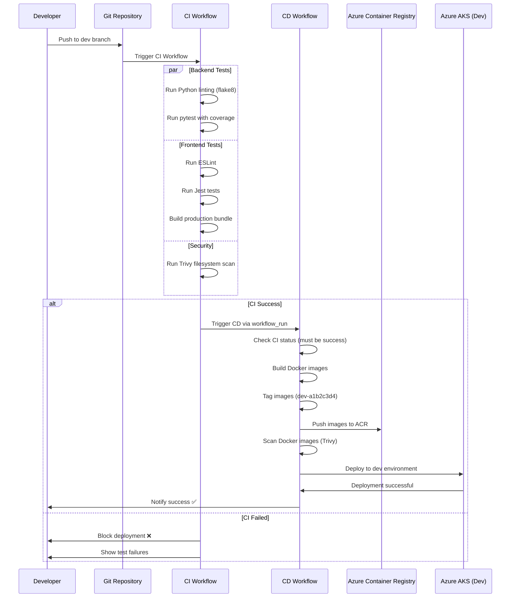
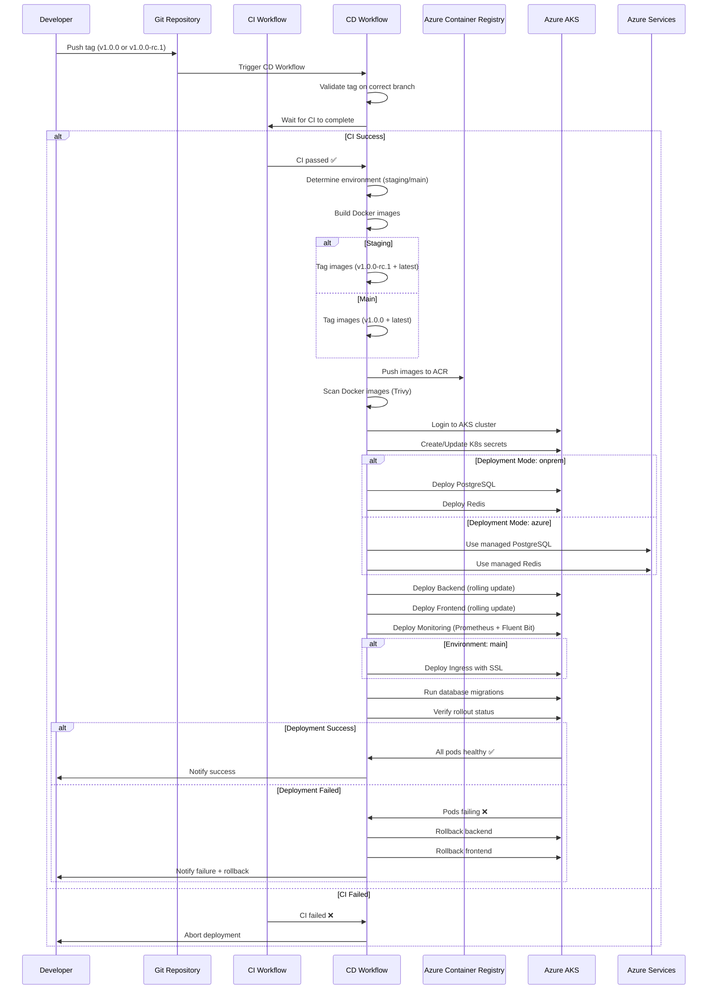
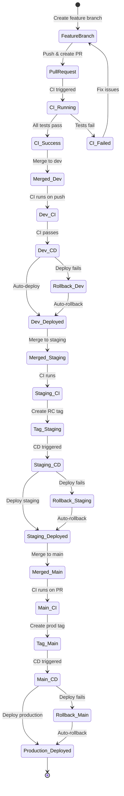

# CI/CD Flow Diagrams

Complete visual representation of the CI/CD pipeline for the AI SaaS Dashboard.

## Table of Contents
- [Overview Flowchart](#overview-flowchart)
- [Dev Branch Sequence](#dev-branch-sequence)
- [Staging/Main Branch Sequence](#stagingmain-branch-sequence)
- [Workflow State Machine](#workflow-state-machine)
- [Branch Strategy](#branch-strategy)

---

## Overview Flowchart

This diagram shows the complete CI/CD flow including all branches and decision points.

```mermaid
graph TB
    subgraph "Developer Actions"
        A[Developer pushes to dev] --> B{Trigger Type}
        C[Developer creates PR] --> D[CI Workflow]
        E[Developer pushes tag to staging/main] --> F{Tag Validation}
    end

    subgraph "CI Workflow - Continuous Integration"
        D --> G[Backend Tests]
        D --> H[Frontend Tests]
        D --> I[Security Scan]

        G --> J{All Tests Pass?}
        H --> J
        I --> J

        J -->|Yes| K[CI Success ✅]
        J -->|No| L[CI Failed ❌]
        L --> M[Block Merge/Deployment]
    end

    subgraph "CD Workflow - Dev Branch"
        B -->|Push to dev| N[Wait for CI]
        K --> N
        N --> O[Build Docker Images]
        O --> P[Tag: dev-{hash}]
        P --> Q[Push to ACR]
        Q --> R[Security Scan Images]
        R --> S[Deploy to Dev Environment]
        S --> T{Deploy Success?}
        T -->|Yes| U[Dev Deployed ✅]
        T -->|No| V[Auto Rollback]
        V --> W[Notify Failure]
    end

    subgraph "CD Workflow - Staging/Main Branches"
        F -->|Valid Tag| X[Wait for CI]
        K --> X
        X --> Y[Determine Environment]
        Y --> Z{Which Branch?}

        Z -->|staging| AA[Build for Staging]
        Z -->|main| AB[Build for Production]

        AA --> AC[Tag: v1.0.0-rc.1 + latest]
        AB --> AD[Tag: v1.0.0 + latest]

        AC --> AE[Push to ACR]
        AD --> AE

        AE --> AF[Security Scan Images]
        AF --> AG[Create K8s Secrets]
        AG --> AH[Deploy Infrastructure]
        AH --> AI{Deployment Mode?}

        AI -->|onprem| AJ[Deploy PostgreSQL + Redis]
        AI -->|azure| AK[Use Azure Managed Services]

        AJ --> AL[Deploy Backend]
        AK --> AL

        AL --> AM[Deploy Frontend]
        AM --> AN[Deploy Monitoring]
        AN --> AO{Environment?}

        AO -->|main| AP[Deploy Ingress]
        AO -->|staging| AQ[Skip Ingress]

        AP --> AR[Run DB Migrations]
        AQ --> AR

        AR --> AS[Health Checks]
        AS --> AT{Deploy Success?}

        AT -->|Yes| AU[Deployed ✅]
        AT -->|No| AV[Auto Rollback]

        AV --> AW[Undo Backend]
        AW --> AX[Undo Frontend]
        AX --> AY[Notify Failure]
    end

    subgraph "Notifications"
        U --> AZ[Send Slack Notification]
        AU --> AZ
        W --> AZ
        AY --> AZ
    end

    style D fill:#4CAF50
    style K fill:#4CAF50
    style L fill:#f44336
    style U fill:#4CAF50
    style AU fill:#4CAF50
    style V fill:#FF9800
    style AV fill:#FF9800
    style M fill:#f44336
```

---

## Dev Branch Sequence

Detailed sequence diagram showing the automated deployment flow for the dev branch.



**Key Points:**
- ✅ Automatic deployment on every push
- ✅ CI must pass before CD runs
- ✅ Images tagged with commit hash
- ✅ Fast feedback loop for developers

---

## Staging/Main Branch Sequence

Detailed sequence diagram showing the tag-based deployment flow for staging and production.



**Key Points:**
- ✅ Tag-based deployment (controlled releases)
- ✅ CI must pass before deployment
- ✅ Supports both Azure and on-premise modes
- ✅ Automatic rollback on failure
- ✅ Production gets SSL ingress

---

## Workflow State Machine

Complete state machine showing all possible states and transitions in the CI/CD workflow.



**State Descriptions:**

| State | Description | Next Actions |
|-------|-------------|--------------|
| `FeatureBranch` | Developer working on feature | Create PR when ready |
| `PullRequest` | PR created, awaiting CI | CI runs automatically |
| `CI_Running` | Tests executing | Pass or fail |
| `CI_Success` | All tests passed | Merge to target branch |
| `CI_Failed` | Tests failed | Fix and push again |
| `Merged_Dev` | Merged to dev branch | CI runs, then auto-deploy |
| `Dev_Deployed` | Deployed to dev environment | Test and promote |
| `Tag_Staging` | Tag created on staging | CD deploys to staging |
| `Staging_Deployed` | Deployed to staging | Test and promote |
| `Tag_Main` | Tag created on main | CD deploys to production |
| `Production_Deployed` | Live in production | Monitor |
| `Rollback_*` | Deployment failed | Auto-rollback triggered |

---

## Branch Strategy

Visual representation of the branching model and deployment targets.

```mermaid
gitGraph
    commit id: "Initial commit"
    branch dev
    checkout dev
    commit id: "Feature A"
    commit id: "Feature B"
    commit id: "Bug fix" tag: "dev-a1b2c3d4"

    branch staging
    checkout staging
    merge dev
    commit id: "Prepare staging" tag: "v1.0.0-rc.1"

    checkout dev
    commit id: "Feature C"
    commit id: "Feature D"

    checkout staging
    merge dev
    commit id: "Staging ready" tag: "v1.0.0-rc.2"

    branch main
    checkout main
    merge staging tag: "v1.0.0"

    checkout dev
    commit id: "Feature E"
    commit id: "Feature F"

    checkout main
    branch hotfix
    commit id: "Critical fix"

    checkout main
    merge hotfix tag: "v1.0.1"

    checkout staging
    merge main

    checkout dev
    merge staging
```

**Branch Flow:**
1. 🔵 **dev** - Daily development, auto-deploys on every push
2. 🟡 **staging** - Pre-production, deploys on RC tags (v1.0.0-rc.1)
3. 🟢 **main** - Production, deploys on release tags (v1.0.0)
4. 🔴 **hotfix** - Emergency fixes from main, merge back to all branches

---

## CI/CD Pipeline Summary

### Trigger Matrix

| Action | Branch | CI Runs | CD Runs | Deployment | Image Tag |
|--------|--------|---------|---------|------------|-----------|
| Create PR | any → dev/staging/main | ✅ Yes | ❌ No | None | N/A |
| Merge PR | → dev | ✅ Yes | ✅ Yes | Dev | `dev-{hash}` |
| Push commit | dev | ✅ Yes | ✅ Yes | Dev | `dev-{hash}` |
| Push commit | staging | ✅ Yes | ❌ No | None | N/A |
| Push commit | main | ❌ No (PR only) | ❌ No | None | N/A |
| Push tag `v*-rc.*` | staging | ⏳ Wait | ✅ Yes | Staging | `v1.0.0-rc.1` + `latest` |
| Push tag `v*` | main | ⏳ Wait | ✅ Yes | Production | `v1.0.0` + `latest` |
| Manual dispatch | any | ⏳ Wait | ✅ Yes | Selected | Based on input |

### Environment Configuration

| Environment | Auto-Deploy | Requires Tag | Replicas | Ingress | SSL |
|-------------|-------------|--------------|----------|---------|-----|
| **Dev** | ✅ Yes | ❌ No | 1 | Optional | No |
| **Staging** | ❌ No | ✅ Yes (RC) | 2-3 | Optional | Optional |
| **Production** | ❌ No | ✅ Yes | 3-10 | ✅ Yes | ✅ Yes |

---

## Viewing the Diagrams

These Mermaid diagrams can be viewed in:

1. **GitHub** - Renders automatically in markdown
2. **VS Code** - Install "Markdown Preview Mermaid Support" extension
3. **Mermaid Live Editor** - Copy diagram code to https://mermaid.live
4. **Documentation Sites** - Most support Mermaid (GitBook, Docusaurus, etc.)

---

## Related Documentation

- [Branching Strategy](../BRANCHING_STRATEGY.md) - Complete workflow guide
- [CI/CD Pipeline](CICD_README.md) - Detailed implementation
- [Release Process](RELEASE_PROCESS.md) - Tag naming and release workflow
- [Quick Start](QUICKSTART_CICD.md) - Fast-track deployment guide

---

**Last Updated**: 2025-11-13
**Version**: 1.0.0
